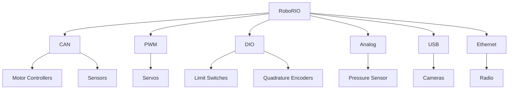

# RoboRIO

The RoboRIO is the central control computer for FRC robots. It runs your RobotPy code, interfaces with hardware, and connects to the field network.

## I/O and Buses

## Deployment and Runtime
- Code entry point: `robot.py` with `wpilib.run(MyRobot)`
- Typical control loop: 50Hz periodic methods (TimedRobot, CommandScheduler)
- Use `mdbook-repl` here only for learning; real robot code deploys via pyfrc or VS Code WPILib tools

## Networking
- mDNS names: `roborio-XXXX-frc.local`
- Static IP convention: `10.TE.AM.2`
- NetworkTables: primary telemetry channel to dashboards and coprocessors

## Best Practices
- Keep CAN IDs unique and documented
- Use brownout-friendly current limits on motor controllers
- Log critical telemetry for post-match analysis

{{#authors lmaxwell24}}
