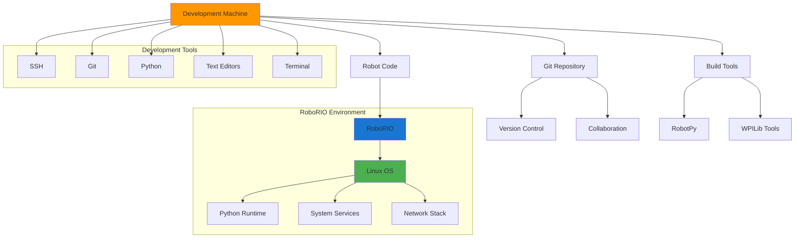

# Linux for FRC Development

Linux plays a crucial role in FIRST Robotics Competition (FRC) development, serving as both the foundation for robot control systems and the preferred development environment for many teams. This section covers Linux fundamentals specifically tailored for FRC robotics programming.

## Why Linux Matters in FRC

Linux is the underlying operating system behind [RoboRIOs](../hardware/roborio.md), the main control unit for FRC robots. Understanding Linux concepts helps you:

- **Debug robot issues**: SSH into the RoboRIO to diagnose problems
- **Develop efficiently**: Use powerful command-line tools for faster development
- **Understand system behavior**: Know how your robot code interacts with the OS
- **Deploy code reliably**: Understand the deployment process and troubleshoot issues
- **Manage development environments**: Set up consistent, reproducible development setups

## Linux in the FRC Ecosystem



## Key Linux Concepts for FRC

### File System Structure
Understanding the Linux file system helps when working with RoboRIO files:
- `/home/lvuser/` - User home directory on RoboRIO
- `/usr/local/frc/` - FRC-specific files and libraries
- `/etc/` - System configuration files
- `/var/log/` - System and application logs

### Processes and Services
- **systemd**: Service management system used on RoboRIO
- **Process monitoring**: Understanding how robot code runs as a service
- **Resource management**: CPU, memory, and I/O considerations

### Networking
- **Network interfaces**: Ethernet, WiFi, USB connections
- **Port forwarding**: Accessing robot services from development machine
- **SSH tunneling**: Secure remote access to robot systems

## Development Environment Setup

A proper Linux development environment for FRC includes:

1. **Terminal and Shell**: Command-line interface for efficiency
2. **Git and Version Control**: Code management and collaboration
3. **Python Environment**: Virtual environments and package management
4. **SSH Tools**: Remote access to robot systems
5. **Text Editors/IDEs**: Code editing with FRC-specific features

## What's Covered in This Section

- **[RoboRIO System Internals](linux/roborio-system.md)**: Deep dive into RoboRIO's Linux environment
- **[Development Tools](linux/dev-tools.md)**: Git, lazygit, bash scripting, and SSH workflows
- **[Python Development](linux/python-dev.md)**: Setting up Python environments for FRC development
- **[System Administration](linux/system-admin.md)**: Managing Linux systems for robotics

## Quick Start Commands

Here are essential commands every FRC developer should know:

```bash path=null start=null
# Connect to RoboRIO via SSH
ssh admin@roborio-TEAM-frc.local

# Check robot code status
sudo systemctl status robot

# View robot code logs
journalctl -u robot -f

# Deploy robot code (from development machine)
python robot.py deploy

# Check network connectivity
ping roborio-TEAM-frc.local
```

## Learning Path

1. **Start with basics**: Command line navigation and file operations
2. **Learn Git**: Version control for team collaboration
3. **Master SSH**: Remote access and troubleshooting
4. **Understand processes**: How robot code runs on the RoboRIO
5. **Practice debugging**: Using logs and system tools to solve problems

Whether you're new to Linux or looking to deepen your understanding for FRC development, this section provides practical knowledge you'll use throughout your robotics journey.
