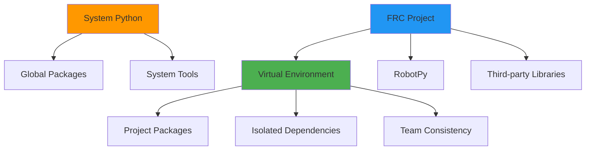

# Python Development Environment on Linux for FRC

Setting up an efficient Python development environment on Linux is crucial for FRC robotics programming. This guide covers the essential tools, configurations, and workflows specific to RobotPy development.

## Python Environment Management

Managing Python environments properly ensures consistent, reproducible builds across team members and prevents dependency conflicts.

### System Python vs Virtual Environments



**Best Practice**: Always use virtual environments for FRC projects. `pipenv` is the recommended tool for managing virtual environments and dependencies, as it simplifies the workflow and ensures consistency.

### Using Pipenv

`pipenv` is a tool that automatically creates and manages a virtualenv for your projects, as well as adds/removes packages from your `Pipfile` as you install/uninstall packages.

First, install `pipenv`:
```bash
# Using pip
pip install --user pipenv

# Or using your system's package manager (Debian/Ubuntu)
sudo apt install pipenv
```

To create a new project environment:
```bash
# Navigate to your robot code directory
cd ~/frc-robot-2024

# Create a Pipfile and install dependencies (if any)
# You can specify a Python version
pipenv install --python 3.11

# Activate the virtual environment
pipenv shell

# Verify activation (should show virtual env path)
which python
```

To install packages:
```bash
# Install a package and add it to Pipfile
pipenv install robotpy[all]

# Install a development-only dependency
pipenv install --dev pytest
```

### Managing Dependencies with Pipfile

`pipenv` uses `Pipfile` and `Pipfile.lock` to manage dependencies. The `Pipfile` is where you declare your project's dependencies, while `Pipfile.lock` ensures deterministic builds by locking down the exact versions of the dependencies.

Here is an example `Pipfile` for an FRC project:
```toml
[packages]
robotpy = {extras = ["all"], version = "*"}
robotpy-pathplannerlib = "*"

[dev-packages]
pytest = "*"
black = "*"
flake8 = "*"
mypy = "*"

[requires]
python_version = "3.11"
```

## Development Tools and IDE Setup

### Text Editors and IDEs

#### VS Code Setup

Install extensions for Python and FRC development:

```json
{
    "recommendations": [
        "ms-python.python",
        "ms-python.black-formatter",
    ]
}
```

VS Code's Python extension will automatically detect and use the `pipenv` environment.

VS Code settings for FRC projects (`.vscode/settings.json`):

```json
{
    "python.formatting.provider": "black",
    "files.exclude": {
        "**/__pycache__": true,
        "**/.pytest_cache": true
    }
}
```

#### Vim/Neovim Setup

For terminal-based development, configure Python language server:

```vim
" Using vim-plug
Plug 'neovim/nvim-lspconfig'
Plug 'hrsh7th/nvim-cmp'
Plug 'hrsh7th/cmp-nvim-lsp'
Plug 'psf/black'

" LSP configuration
lua << EOF
require'lspconfig'.pyright.setup{}
EOF
```

### Code Quality Tools

Install code quality tools as development dependencies:
```bash
pipenv install --dev black flake8 mypy
```

#### Black (Code Formatting)

```bash
# Format all Python files
pipenv run black src/

# Check formatting without changes
pipenv run black --check src/
```

Configuration in `pyproject.toml`:

```toml
[tool.black]
line-length = 88
target-version = ['py311']
include = '\.pyi?

extend-exclude = '''
/(
  # Exclude auto-generated files
  | build
  | dist
)/
'''
```

#### Flake8 (Linting)

```bash
# Lint all files
pipenv run flake8 src/

# Configuration file: .flake8
[flake8]
max-line-length = 88
extend-ignore = E203, W503
exclude = .git,__pycache__,build,dist
```

#### MyPy (Type Checking)

```bash
# Type check code
pipenv run mypy src/

# Configuration in mypy.ini
[mypy]
python_version = 3.11
warn_return_any = True
warn_unused_configs = True
disallow_untyped_defs = True

[mypy-robotpy.*]
ignore_missing_imports = True
```

## FRC-Specific Python Setup

### RobotPy Installation

```bash
# Install RobotPy with all components
pipenv install robotpy[all]

# Download and install RoboRIO packages
pipenv run python -m robotpy_installer download-python

# Install specific components only
pipenv install robotpy robotpy-wpilib robotpy-commands-v2
```

### Project Structure

Recommended directory structure for FRC Python projects:

```
frc-robot-2024/
├── robot.py                 # Main robot entry point
├── constants.py             # Robot constants
├── Pipfile                  # Python dependencies
├── Pipfile.lock             # Pinned dependency versions
├── pyproject.toml           # Project configuration
├── .gitignore               # Git ignore patterns
├── src/                     # Source code
│   ├── __init__.py
│   ├── subsystems/          # Robot subsystems
│   ├── commands/            # Robot commands
│   └── utils/               # Utility functions
├── tests/                   # Unit tests
│   ├── __init__.py
│   └── test_robot.py
└── scripts/                 # Deployment and utility scripts
    └── deploy.sh
```

### Environment Variables

`pipenv` automatically manages environment variables within the virtual environment. For project-specific variables, you can create a `.env` file in your project root.

```
# .env file
ROBOTPY_TEAM_NUMBER=1757
ROBOTPY_ROBOT_HOST="roborio-1757-frc.local"
```
`pipenv` will automatically load this file.

For convenience, you can add aliases to your `~/.bashrc` or `~/.zshrc`:
```bash
# FRC-specific aliases
alias deploy='pipenv run python robot.py deploy'
alias sim='pipenv run python robot.py sim'
alias test-robot='pipenv run pytest tests/'
```

## Testing and Debugging

### Unit Testing with pytest

```python
# tests/test_drivetrain.py
import pytest
from src.subsystems.drivetrain import Drivetrain

class TestDrivetrain:
    def setup_method(self):
        self.drivetrain = Drivetrain()
    
    def test_initialization(self):
        assert self.drivetrain is not None
    
    def test_tank_drive(self):
        # Test tank drive functionality
        self.drivetrain.tank_drive(0.5, -0.5)
        # Add assertions for expected behavior
```

Run tests:

```bash
# Run all tests
pipenv run pytest

# Run with coverage
pipenv run pytest --cov=src

# Run specific test file
pipenv run pytest tests/test_drivetrain.py -v
```

### Debugging Techniques

#### Using Python Debugger (pdb)

```python
import pdb

def autonomous(self):
    pdb.set_trace()  # Breakpoint
    # Your code here
```

#### Remote Debugging on RoboRIO

Install `debugpy` as a dev dependency:
```bash
pipenv install --dev debugpy
```

```python
# For remote debugging (use carefully)
import debugpy

debugpy.listen(5678)
debugpy.wait_for_client()  # Optional: wait for debugger
```

## Performance Optimization

### Profiling Robot Code

```python
import cProfile
import pstats

def profile_robot_code():
    pr = cProfile.Profile()
    pr.enable()
    
    # Your robot code here
    
    pr.disable()
    stats = pstats.Stats(pr)
    stats.sort_stats('cumulative')
    stats.print_stats(10)  # Top 10 functions
```

### Memory Management

```python
import gc
import psutil
import os

def monitor_memory():
    process = psutil.Process(os.getpid())
    memory_info = process.memory_info()
    print(f"RSS: {memory_info.rss / 1024 / 1024:.2f} MB")
    print(f"VMS: {memory_info.vms / 1024 / 1024:.2f} MB")
    
    # Force garbage collection
    gc.collect()
```

## Deployment Automation

### Deployment Script

Create `scripts/deploy.sh`:

```bash
#!/bin/bash

set -e  # Exit on any error

echo "Running tests..."
pipenv run pytest tests/ -v

echo "Checking code quality..."
pipenv run black --check src/
pipenv run flake8 src/

echo "Deploying to robot..."
pipenv run python robot.py deploy

echo "Deployment complete!"
```

Make executable:

```bash
chmod +x scripts/deploy.sh
```

### Git Hooks for Quality

Create `.git/hooks/pre-commit`:

```bash
#!/bin/bash

# Run code formatting
pipenv run black src/ tests/

# Run linting
pipenv run flake8 src/ tests/

# Run type checking
pipenv run mypy src/

# Run tests
pipenv run pytest tests/

if [ $? -ne 0 ]; then
    echo "Pre-commit checks failed!"
    exit 1
fi
```

## Team Collaboration Best Practices

### Environment Consistency

1. **Document Python version**: Use `.python-version` file or specify in `Pipfile`.
2. **Pin dependencies**: `Pipfile.lock` handles this automatically. Commit `Pipfile.lock` to your repository.
3. **Share configurations**: Include editor configs in repository.
4. **Automate setup**: Provide setup scripts for new team members.

### Setup Script for New Members

Create `setup.sh`:

```bash
#!/bin/bash

echo "Setting up FRC development environment..."

# Check for pipenv
if ! command -v pipenv &> /dev/null
then
    echo "pipenv could not be found. Please install it first."
    echo "Run: pip install --user pipenv"
    exit
fi

# Install dependencies from Pipfile.lock
pipenv install --dev

# Install RobotPy for robot
pipenv run python -m robotpy_installer download-python

echo "Setup complete! Run 'pipenv shell' to activate."
```

## Troubleshooting Common Issues

### Import Errors

```bash
# Verify virtual environment python
pipenv run which python

# Check dependency graph
pipenv graph

# Reinstall packages
pipenv install --reinstall robotpy
```

### Deployment Issues

```bash
# Check robot connectivity
ping roborio-1757-frc.local

# Verify robotpy installation on robot
pipenv run python -m robotpy_installer list

# Manual deployment
pipenv run python -m robotpy_installer install-python
pipenv run python robot.py deploy --builtin
```

### Performance Issues

```bash
# Monitor robot resources via SSH
ssh admin@roborio-1757-frc.local "top -n 1"

# Check for memory leaks
ssh admin@roborio-1757-frc.local "cat /proc/meminfo"
```

This comprehensive Python development setup ensures efficient, consistent, and maintainable FRC robot code development on Linux systems.
