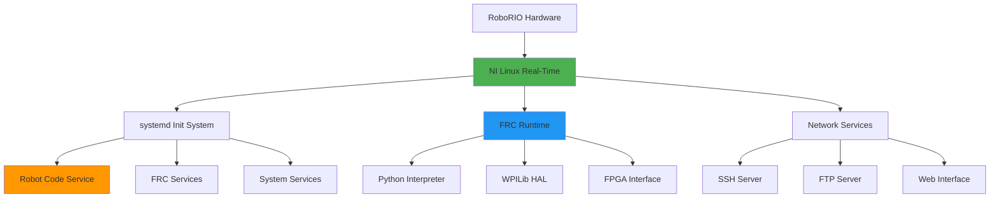

# RoboRIO System Internals

The RoboRIO runs a specialized Linux distribution optimized for real-time robotics control. Understanding its internals helps you debug issues, optimize performance, and make the most of your robot's capabilities.

## System Overview

The RoboRIO uses a **NI Linux Real-Time** operating system, which is based on:
- **Kernel**: Linux with real-time patches
- **Architecture**: ARM Cortex-A9 (ARMv7)
- **Init System**: systemd
- **Package Manager**: opkg (OpenWrt-based)



## File System Structure

Understanding the RoboRIO's file system is crucial for debugging and development:

### Key Directories

```bash path=null start=null
/home/lvuser/           # User home directory (where your code runs)
├── py/                 # Python robot code deployment location
├── .cache/            # Application cache files
└── .config/           # User configuration files

/usr/local/frc/        # FRC-specific installations
├── JRE/               # Java Runtime Environment
├── bin/               # FRC utilities and tools
├── lib/               # FRC libraries
└── third-party/       # Third-party libraries

/var/local/natinst/    # National Instruments specific files
├── log/               # System logs
└── config/            # NI configuration

/etc/                  # System configuration files
├── natinst/           # NI-specific configuration
├── systemd/           # Service definitions
└── network/           # Network configuration

/opt/                  # Optional software packages
└── ...

/tmp/                  # Temporary files (cleared on reboot)
```

### Important Files

- `/home/lvuser/robot.py` - Main robot code entry point
- `/etc/natinst/share/scs_imagemetadata.ini` - System image information
- `/var/log/messages` - System log messages
- `/etc/hostname` - System hostname configuration

## System Services

The RoboRIO uses systemd to manage services. Here are the key services for FRC:

### Robot Code Service

Your robot code runs as a systemd service called `robot`:

```bash path=null start=null
# Check robot code status
sudo systemctl status robot

# Start robot code
sudo systemctl start robot

# Stop robot code  
sudo systemctl stop robot

# Restart robot code
sudo systemctl restart robot

# Enable robot code to start on boot
sudo systemctl enable robot

# View robot code service definition
cat /lib/systemd/system/robot.service
```

### FRC-Related Services

```bash path=null start=null
# FRC Driver Station communication
sudo systemctl status frcds

# Network communication services
sudo systemctl status netconsole-host
sudo systemctl status systemWebServer

# Time synchronization
sudo systemctl status ntp
```

## SSH Access and Remote Management

SSH is your primary tool for accessing and managing the RoboRIO remotely.

### Connecting to the RoboRIO

```bash path=null start=null
# Standard connection (replace TEAM with your team number)
ssh admin@roborio-TEAM-frc.local

# Alternative IP addresses
ssh admin@10.TE.AM.2        # Ethernet connection
ssh admin@172.22.11.2       # USB connection

# With verbose output for debugging
ssh -v admin@roborio-TEAM-frc.local
```

### Default Credentials

- **Username**: `admin`
- **Password**: (empty - just press Enter)

### SSH Key Setup

For secure, passwordless access, set up SSH keys:

```bash path=null start=null
# Generate SSH key pair (on development machine)
ssh-keygen -t rsa -b 4096 -C "your-email@example.com"

# Copy public key to RoboRIO
ssh-copy-id admin@roborio-TEAM-frc.local

# Or manually copy the key
cat ~/.ssh/id_rsa.pub | ssh admin@roborio-TEAM-frc.local "mkdir -p ~/.ssh && cat >> ~/.ssh/authorized_keys"
```

### Useful SSH Commands

```bash path=null start=null
# File transfer with SCP
scp robot.py admin@roborio-TEAM-frc.local:/home/lvuser/
scp admin@roborio-TEAM-frc.local:/var/log/messages ./roborio-logs.txt

# Port forwarding for web interfaces
ssh -L 8080:localhost:80 admin@roborio-TEAM-frc.local

# Run single commands remotely
ssh admin@roborio-TEAM-frc.local "systemctl status robot"

# Interactive session with X11 forwarding
ssh -X admin@roborio-TEAM-frc.local
```

## Process Management

Understanding processes helps with debugging and performance monitoring:

### Viewing Processes

```bash path=null start=null
# List all processes
ps aux

# Show process tree
pstree

# Real-time process monitoring
top
htop  # If available

# Find specific processes
ps aux | grep python
pgrep -f robot.py
```

### Process Control

```bash path=null start=null
# Kill a specific process
kill <PID>
killall python3

# Force kill unresponsive process
kill -9 <PID>

# Send signals to processes
kill -USR1 <PID>  # Send user-defined signal
```

## System Monitoring and Diagnostics

### System Information

```bash path=null start=null
# System information
uname -a                    # Kernel and system info
cat /proc/version          # Detailed kernel version
cat /proc/cpuinfo          # CPU information
cat /proc/meminfo          # Memory information

# Disk usage
df -h                      # File system usage
du -h /home/lvuser/       # Directory size

# Network interfaces
ip addr show              # Network interface information
ip route show             # Routing table
```

### Log Analysis

Logs are crucial for debugging robot issues:

```bash path=null start=null
# View robot code logs
journalctl -u robot        # All robot service logs
journalctl -u robot -f     # Follow robot logs in real-time
journalctl -u robot --since "1 hour ago"

# System logs
tail -f /var/log/messages  # Real-time system messages
dmesg                      # Kernel ring buffer
dmesg | tail               # Recent kernel messages

# Search logs for specific errors
grep -i error /var/log/messages
journalctl -u robot | grep -i exception
```

### Performance Monitoring

```bash path=null start=null
# CPU and memory usage
top -p $(pgrep -f python)  # Monitor robot code specifically

# I/O statistics
iostat                     # If available

# Network statistics
netstat -i                 # Network interface statistics
ss -tuln                   # Socket statistics
```

## Robot Code Deployment Process

Understanding how code gets deployed helps with troubleshooting:

### Deployment Steps

1. **Build**: Code is prepared on development machine
2. **Transfer**: Files are copied to RoboRIO via SSH/SFTP
3. **Permissions**: Execute permissions are set
4. **Service Restart**: Robot service is restarted

```bash path=null start=null
# Manual deployment simulation
scp -r src/* admin@roborio-TEAM-frc.local:/home/lvuser/py/
ssh admin@roborio-TEAM-frc.local "sudo systemctl restart robot"
```

### Deployment Locations

- **Robot code**: `/home/lvuser/py/`
- **Backup location**: `/home/lvuser/py.bak/`
- **Service file**: `/lib/systemd/system/robot.service`

## Troubleshooting Common Issues

### Robot Code Won't Start

```bash path=null start=null
# Check service status
sudo systemctl status robot

# View detailed logs
journalctl -u robot -n 50

# Check file permissions
ls -la /home/lvuser/py/robot.py

# Ensure file is executable
chmod +x /home/lvuser/py/robot.py
```

### Network Connectivity Issues

```bash path=null start=null
# Test network connectivity
ping 8.8.8.8               # Internet connectivity
ping 10.TE.AM.1            # Router connectivity

# Check network configuration
ip addr show
ip route show

# Restart network services
sudo systemctl restart networking
```

### Performance Issues

```bash path=null start=null
# Check system load
uptime
cat /proc/loadavg

# Monitor resource usage
top
iostat 1 5

# Check for memory leaks
cat /proc/meminfo | grep -i available
```

### Disk Space Issues

```bash path=null start=null
# Check disk usage
df -h

# Find large files
du -h /home/lvuser/ | sort -h

# Clean temporary files
sudo rm -rf /tmp/*
sudo journalctl --vacuum-time=7d  # Keep only 7 days of logs
```

## Advanced System Configuration

### Custom Services

You can create custom systemd services for additional functionality:

```ini path=null start=null
# Example: /lib/systemd/system/custom-logger.service
[Unit]
Description=Custom Robot Logger
After=robot.service

[Service]
Type=simple
User=lvuser
ExecStart=/home/lvuser/custom_logger.py
Restart=always
RestartSec=5

[Install]
WantedBy=multi-user.target
```

### Network Configuration

The RoboRIO's network setup can be customized:

```bash path=null start=null
# View network configuration
cat /etc/systemd/network/

# Modify network settings (be careful!)
sudo vi /etc/systemd/network/10-eth0.network
```

## Best Practices

1. **Regular Backups**: Keep backups of working configurations
2. **Log Monitoring**: Regularly check logs for warnings
3. **Resource Monitoring**: Monitor CPU and memory usage during competition
4. **Network Health**: Ensure stable network connections
5. **Service Management**: Use systemd properly for service control

## Security Considerations

- **Change default passwords**: Set strong passwords for admin account
- **SSH Key Authentication**: Use SSH keys instead of passwords
- **Network Segmentation**: Isolate robot network from other systems
- **Regular Updates**: Keep system packages updated when possible
- **Access Control**: Limit who has SSH access to the robot

Understanding these RoboRIO internals will make you a more effective FRC developer, capable of diagnosing and solving complex robot issues quickly and efficiently.
