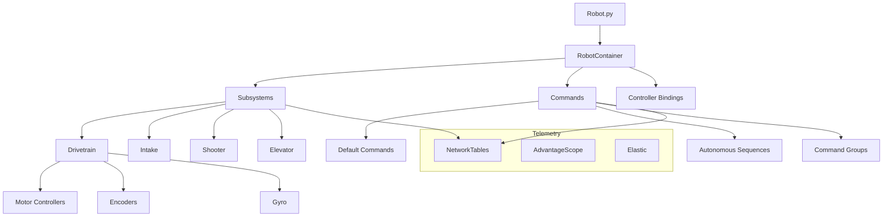

# RobotPy

RobotPy is a set of Python modules that allows for the development of robot code for the FIRST Robotics Competition (FRC) in Python. It provides a powerful and easy-to-use framework for controlling the robot's hardware and implementing complex autonomous and teleoperated behaviors.

## Architecture Overview

Key concepts covered in this section:
- Command-Based Programming: organizing behaviors via composable commands
- Subsystems: hardware abstraction with periodic updates and state
- Controllers: PID, Bang-Bang, Ramsete, profiled controllers
- Path Following: PathPlanner integration and trajectory tracking
- Telemetry and Logging: AdvantageScope, Elastic dashboards

See also:
- [Robot file structure](./file.md)
- [Subsystems](./subsystem.md)
- [Commands](./commands.md)
- [Controllers](./controller/README.md)
- [NetworkTables](./nettables.md)
- [PathPlanner](./pp.md)

This project uses `pipenv` for dependency management and `black`/`prettier` for formatting. See the [Tools](../README.md) section.

For comprehensive reference, visit the official RobotPy docs: https://robotpy.readthedocs.io/
