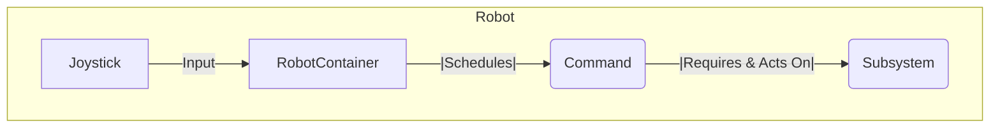

# Commands

A command is a Python class that represents a specific action that the robot can perform. The command-based framework is built around the interaction between user input (joysticks), commands, and subsystems.



Commands are typically scheduled by the `CommandScheduler` and are executed in a series of steps, known as the command lifecycle.

### Command Lifecycle

```mermaid
graph TD
    Start --> A(initialize());
    A --> B{isFinished?};
    B --|No|--> C(execute());
    C --> B;
    B --|Yes|--> D(end(interrupted=false));
    subgraph Interruption
        B --> E(end(interrupted=true));
        C --> E;
    end
```

1.  **`initialize()`**: Called once when the command is first scheduled.
2.  **`execute()`**: Called repeatedly while the command is running.
3.  **`isFinished()`**: Called after each call to `execute()` to determine if the command has finished.
4.  **`end()`**: Called once when the command finishes or is interrupted.

By breaking down the robot's behaviors into a set of commands, you can make your code more modular, reusable, and easier to understand.

### Example: Team 1757 Drive Command

Team 1757's drive command demonstrates advanced swerve drive control with alliance awareness, automatic defense state, and field-relative driving with rotation PID control.

```python
from math import atan2, pi
import typing
from commands2 import Command
from wpilib import DriverStation
from wpimath.controller import PIDController
from wpimath.geometry import Rotation2d
from subsystems.drive.drivesubsystem import DriveSubsystem
from util.angleoptimize import optimizeAngle
from constants.trajectory import kRotationPGain, kRotationIGain, kRotationDGain

class AbsoluteRelativeDrive(Command):
    def __init__(
        self,
        drive: DriveSubsystem,
        forward: typing.Callable[[], float],
        sideways: typing.Callable[[], float],
        rotationX: typing.Callable[[], float],
        rotationY: typing.Callable[[], float],
    ) -> None:
        Command.__init__(self)
        self.setName(__class__.__name__)

        self.drive = drive
        self.forward = forward
        self.sideways = sideways
        
        # PID controller for rotation to target heading
        self.rotationPid = PIDController(kRotationPGain, kRotationIGain, kRotationDGain)
        self.rotationY = rotationY
        self.rotationX = rotationX

        self.addRequirements(self.drive)

    def rotation(self) -> float:
        """Calculate rotation speed to reach target heading from right joystick"""
        # Use atan2 to get target angle from joystick vector
        targetRotation = atan2(self.rotationX(), self.rotationY())
        
        # If no rotation input, maintain current heading
        if self.rotationX() == 0 and self.rotationY() == 0:
            return 0

        # Alliance-aware rotation - red alliance flips 180 degrees
        if DriverStation.getAlliance() == DriverStation.Alliance.kRed:
            targetRotation += pi

        # Optimize angle to avoid unnecessary rotation
        optimizedDirection = optimizeAngle(
            self.drive.getRotation(), Rotation2d(targetRotation)
        ).radians()
        
        # Use PID to smoothly rotate to target
        return self.rotationPid.calculate(
            self.drive.getRotation().radians(), optimizedDirection
        )

    def execute(self) -> None:
        rotation = self.rotation()
        
        # Enter defense state when no input (within deadband)
        if (
            abs(self.forward()) < 0.01
            and abs(self.sideways()) < 0.01
            and abs(rotation) < 0.01
        ):
            self.drive.defenseState()
        else:
            # Alliance-aware field-relative driving
            if DriverStation.getAlliance() == DriverStation.Alliance.kRed:
                self.drive.arcadeDriveWithFactors(
                    -self.forward(),
                    -self.sideways(),
                    rotation,
                    DriveSubsystem.CoordinateMode.FieldRelative,
                )
            else:
                self.drive.arcadeDriveWithFactors(
                    self.forward(),
                    self.sideways(),
                    rotation,
                    DriveSubsystem.CoordinateMode.FieldRelative,
                )
```

### Example: Distance-Based Drive Command

Team 1757 uses robot-relative driving for precise autonomous movements like driving a specific distance.

```python
from commands2 import Command
from wpimath.geometry import Pose2d, Translation2d
from subsystems.drive.drivesubsystem import DriveSubsystem
from constants.drive import kWheelCircumference
from enum import Enum, auto

class DriveDistance(Command):
    class Axis(Enum):
        X = auto()
        Y = auto()

    def __init__(self, distance: float, speed: float, axis: Axis, drive: DriveSubsystem):
        Command.__init__(self)
        self.distance = distance
        self.speed = speed
        self.axis = axis
        self.drive = drive
        self.startPose = None
        
        self.addRequirements(drive)

    def initialize(self):
        """Record starting position for distance measurement"""
        self.startPose = self.drive.getPose()

    def execute(self):
        """Drive at constant speed in specified direction"""
        if self.axis == DriveDistance.Axis.X:
            # Forward/backward movement
            self.drive.arcadeDriveWithFactors(
                self.speed,
                0,
                0,
                DriveSubsystem.CoordinateMode.RobotRelative
            )
        else:
            # Left/right movement
            self.drive.arcadeDriveWithFactors(
                0,
                self.speed,
                0,
                DriveSubsystem.CoordinateMode.RobotRelative
            )

    def isFinished(self) -> bool:
        """Check if we've traveled the target distance"""
        currentPose = self.drive.getPose()
        displacement = currentPose.translation() - self.startPose.translation()
        
        if self.axis == DriveDistance.Axis.X:
            return abs(displacement.X()) >= abs(self.distance)
        else:
            return abs(displacement.Y()) >= abs(self.distance)

    def end(self, interrupted: bool):
        """Stop the robot"""
        self.drive.arcadeDriveWithFactors(0, 0, 0, DriveSubsystem.CoordinateMode.RobotRelative)
```

### Example: Defense State Command

A command that locks the swerve modules in an X-pattern for defensive stability.

```python
from commands2 import Command
from subsystems.drive.drivesubsystem import DriveSubsystem

class DefenseState(Command):
    def __init__(self, drive: DriveSubsystem):
        Command.__init__(self)
        self.drive = drive
        self.addRequirements(drive)

    def execute(self):
        """Lock wheels in X pattern"""
        self.drive.defenseState()

    def isFinished(self) -> bool:
        """Run until interrupted"""
        return False

    def end(self, interrupted: bool):
        """Return to normal driving when command ends"""
        pass  # Default drive command will take over
```

### Example: Team 1757 Autonomous Command Group

Team 1757 uses command groups for autonomous routines, combining drive commands with subsystem actions.

```python
import commands2
from commands.resetdrive import ResetDrive
from commands.drivedistance import DriveDistance
from wpimath.geometry import Pose2d
from constants.drive import kWheelCircumference

class SimpleAuto(commands2.SequentialCommandGroup):
    def __init__(self, drive):
        super().__init__(
            # Reset odometry to known starting position
            ResetDrive(drive, Pose2d(0, 0, 0)),
            
            # Drive forward 4 wheel circumferences at 20% speed
            DriveDistance(
                -4 * kWheelCircumference,
                0.2,
                DriveDistance.Axis.X,
                drive,
            ),
        )
        self.setName("SimpleAuto")
```

## Team 1757 Command Integration Patterns

### RobotContainer Command Binding

Team 1757 uses a centralized approach to command binding in `RobotContainer`:

```python
class RobotContainer:
    def __init__(self):
        # Initialize subsystems
        self.drive = DriveSubsystem()
        
        # Set default commands
        self.drive.setDefaultCommand(
            AbsoluteRelativeDrive(
                self.drive,
                lambda: OperatorInterface.Drive.ChassisControls.Translation.y() * kTurboSpeedMultiplier,
                lambda: OperatorInterface.Drive.ChassisControls.Translation.x() * kTurboSpeedMultiplier,
                OperatorInterface.Drive.ChassisControls.Rotation.x,
                OperatorInterface.Drive.ChassisControls.Rotation.y,
            )
        )
        
        self.configureButtonBindings()

    def configureButtonBindings(self):
        # Angle alignment while driving
        OperatorInterface.Drive.align_angle().whileTrue(
            AngleAlignDrive(
                self.drive,
                lambda: OperatorInterface.Drive.ChassisControls.Translation.y() * kNormalSpeedMultiplier,
                lambda: OperatorInterface.Drive.ChassisControls.Translation.x() * kNormalSpeedMultiplier,
            ).repeatedly()
        )
        
        # Reset gyro/odometry
        OperatorInterface.Drive.reset_gyro().onTrue(
            ResetDrive(self.drive, Pose2d(0, 0, 0))
        )
        
        # Manual defense state
        OperatorInterface.Drive.defense_state().whileTrue(
            DefenseState(self.drive)
        )
```

### Command Design Principles

1. **Functional Inputs**: Commands accept lambda functions for live value sampling
2. **Alliance Awareness**: Commands adapt behavior based on alliance color
3. **State Management**: Commands handle transitions between robot states (normal, defense, etc.)
4. **Requirements**: Commands properly declare subsystem requirements
5. **Lifecycle Management**: Commands implement proper initialization, execution, and cleanup

### Autonomous Integration

Team 1757 integrates PathPlanner for complex autonomous routines while maintaining simple commands for basic movements:

```python
# PathPlanner autonomous
autoPaths = PathPlannerAuto("YourAutoPath")

# Simple autonomous fallback
simpleAuto = commands2.SequentialCommandGroup(
    ResetDrive(self.drive),
    DriveDistance(-2.0, 0.3, DriveDistance.Axis.X, self.drive),
)

# Chooser allows switching between auto modes
self.chooser.setDefaultOption("Simple Auto", simpleAuto)
self.chooser.addOption("Complex Auto", autoPaths)
```
