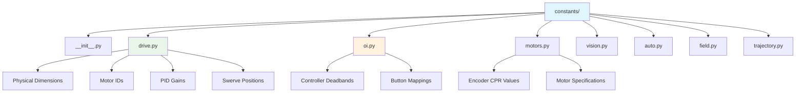

# Constants Organization

Team 1757 uses a modular approach to constants organization, with separate files for each functional area rather than a single `constants.py` file. This approach improves maintainability and reduces merge conflicts in large codebases.

## Modular Constants Structure



## Example: Drive Constants (`constants/drive.py`)

```python
import math
from phoenix6.configs.talon_fx_configs import CurrentLimitsConfigs
from wpimath.geometry import Translation2d
from wpimath.system.plant import DCMotor
from .math import kMetersPerInch, kRadiansPerRevolution

# Physical Robot Parameters
kRobotWidth = 28 * kMetersPerInch
kRobotLength = 26 * kMetersPerInch

# Swerve Module Positions
kSwerveModuleCenterToRobotCenterWidth = 10.375 * kMetersPerInch
kSwerveModuleCenterToRobotCenterLength = 9.375 * kMetersPerInch

kFrontLeftWheelPosition = Translation2d(
    kSwerveModuleCenterToRobotCenterLength,
    kSwerveModuleCenterToRobotCenterWidth,
)

# Wheel and Gearing
kWheelDiameter = 4 * kMetersPerInch
kWheelRadius = kWheelDiameter / 2
kWheelCircumference = kWheelRadius * 2 * math.pi

kDriveGearingRatio = (50 / 14) * (16 / 28) * (45 / 15)
kSteerGearingRatio = 150 / 7

# Velocity and Acceleration Limits
kMaxMotorAngularVelocity = DCMotor.krakenX60().freeSpeed
kMaxWheelAngularVelocity = kMaxMotorAngularVelocity / kDriveGearingRatio
kMaxWheelLinearVelocity = kWheelDistancePerRadian * kMaxWheelAngularVelocity

# Motor Configuration
kCANivoreName = "canivore"
kFrontLeftDriveMotorId = 10
kFrontLeftSteerMotorId = 11
# ... more motor IDs

kDriveCurrentLimit = (
    CurrentLimitsConfigs()
    .with_stator_current_limit(35)
    .with_stator_current_limit_enable(True)
    .with_supply_current_limit(35)
    .with_supply_current_limit_enable(True)
)

# Control Gains
kDrivePGain = 0.001
kDriveIGain = 0.0
kDriveDGain = 0.0
kDriveVGain = 0.01  # Feedforward

kSteerPGain = 2
kSteerIGain = 0.0
kSteerDGain = 0

# Encoder Offsets (from calibration procedure)
kFrontLeftAbsoluteEncoderOffset = 0.417969
kFrontRightAbsoluteEncoderOffset = -0.055176
# ... more offsets

# Speed Multipliers
kNormalSpeedMultiplier = 0.50
kTurboSpeedMultiplier = 0.95
```

## Example: Operator Interface Constants (`constants/oi.py`)

```python
# Operator Interface Constants
kXboxJoystickDeadband = 0.1
kKeyboardJoystickDeadband = 0.0
kXboxTriggerActivationThreshold = 0.5
```

## Example: Motor Constants (`constants/motors.py`)

```python
from .math import kRadiansPerRevolution

# Encoder specifications
kCANcoderPulsesPerRevolution = 4096
kCANcoderPulsesPerRadian = kCANcoderPulsesPerRevolution / kRadiansPerRevolution

kTalonEncoderPulsesPerRevolution = 2048
kTalonEncoderPulsesPerRadian = kTalonEncoderPulsesPerRevolution / kRadiansPerRevolution
```

## Constants Package Initialization (`constants/__init__.py`)

```python
"""
The constants module is a convenience place for teams to hold robot-wide
numerical or boolean constants. Don't use this for any other purpose!

Physical constants must have their units specified
Default units:
    Length: meters
    Angle: radians

Axes Convention (right hand rule):
    Translation:
        +X: forward
        +Y: left
        +Z: up

    Rotation:
        +rotate around Z: counterclockwise looking from the top, 0 aligned with +X
"""

kRobotUpdatePeriod = 1 / 50  # 50 Hz control loop
```

## Usage in Code

```python
# Import specific constants
from constants.drive import (
    kFrontLeftDriveMotorId,
    kDriveGearingRatio,
    kMaxWheelLinearVelocity,
    kCANivoreName
)
from constants.oi import kXboxJoystickDeadband

class DriveSubsystem(commands2.SubsystemBase):
    def __init__(self):
        super().__init__()
        
        # Use imported constants
        self.frontLeftDrive = ctre.TalonFX(kFrontLeftDriveMotorId, kCANivoreName)
        self.maxSpeed = kMaxWheelLinearVelocity
```

## Benefits of Modular Organization

### **Maintainability**
- Related constants grouped together
- Easier to find specific values
- Reduced merge conflicts
- Clear ownership of different areas

### **Documentation**
- Units clearly specified for each constant
- Comments explain calibration procedures
- Physical meaning of each value

### **Collaboration**
- Multiple team members can work on different constant files
- Mechanical team updates physical constants
- Programming team updates control gains
- Vision team updates camera parameters

### **Validation**
- Easier to validate related constants together
- Unit consistency checking within functional areas
- Clear dependencies between constants

## Best Practices

1. **Use descriptive names**: `kFrontLeftAbsoluteEncoderOffset` vs `FL_OFFSET`
2. **Include units**: Document units in comments or variable names
3. **Group related constants**: Keep subsystem constants together
4. **Use Python constants convention**: ALL_CAPS for true constants
5. **Calculate derived values**: Show relationships between constants
6. **Document calibration**: Explain how measured values were obtained
