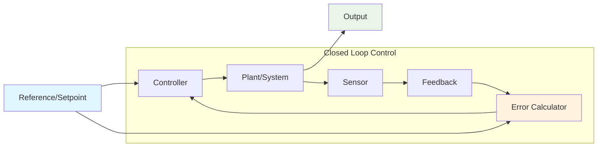
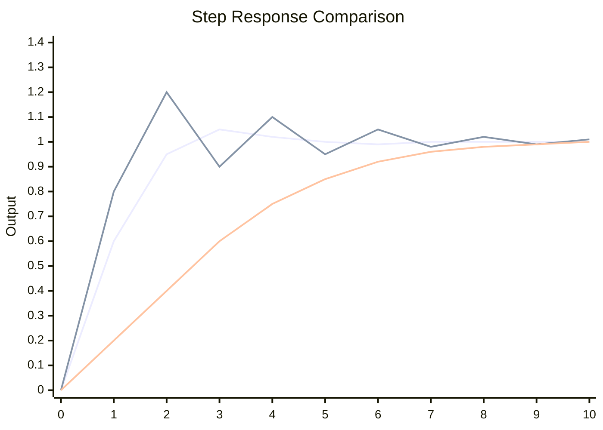
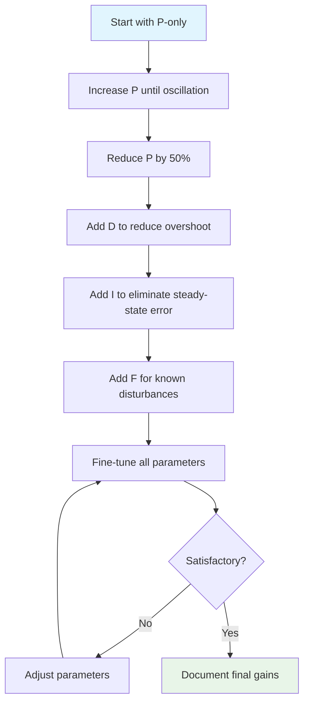

# Controllers

Controllers are algorithms that automatically adjust system outputs to achieve desired behaviors. In robotics, they're essential for precise motion control, maintaining setpoints, and responding to disturbances. RobotPy provides several controller types, each suited for different applications.

## Control Theory Fundamentals



### Key Concepts

- **Plant**: The system being controlled (motor, elevator, drivetrain)
- **Setpoint**: Desired output value (target position, velocity)
- **Error**: Difference between setpoint and actual output
- **Feedback**: Measured system output (encoder, gyro, vision)
- **Control Signal**: Controller output to the plant

### Controller Types Comparison

| Controller | Complexity | Tuning Effort | Best Use Cases | Steady-State Error |
|------------|------------|---------------|----------------|--------------------|
| **Bang-Bang** | Very Low | None | Binary states, simple mechanisms | High |
| **PID** | Medium | Moderate | Position/velocity control | Low (with I term) |
| **PIDF** | Medium-High | High | Systems with known dynamics | Very Low |
| **Profiled PID** | High | High | Smooth motion profiles | Very Low |

## System Response Characteristics



### Performance Metrics

- **Rise Time**: Time to reach 90% of setpoint
- **Settling Time**: Time to stay within ±5% of setpoint
- **Overshoot**: Peak value beyond setpoint
- **Steady-State Error**: Final error after settling

## Controller Selection Guide

### Bang-Bang Controller
- **When to use**: Binary operations, systems with hysteresis
- **Examples**: Compressors, simple intakes, binary mechanisms
- **Advantages**: Simple, robust, fast response
- **Disadvantages**: Oscillation, wear, inefficiency

### PID Controller
- **When to use**: Continuous control, position/velocity regulation
- **Examples**: Arm positioning, shooter speed, drivetrain heading
- **Advantages**: Versatile, well-understood, handles disturbances
- **Disadvantages**: Requires tuning, can be sluggish

### PIDF Controller
- **When to use**: Systems with known dynamics, gravity compensation
- **Examples**: Elevators, arms against gravity, flywheels
- **Advantages**: Fast response, reduced steady-state error
- **Disadvantages**: Requires system modeling, complex tuning

## Tuning Process Overview



## Implementation in RobotPy

### Basic Controller Usage Pattern

```python
# Standard pattern for controller implementation
class ControlledSubsystem(commands2.SubsystemBase):
    def __init__(self):
        super().__init__()
        self.motor = ctre.WPI_TalonFX(1)
        self.encoder = self.motor.getSelectedSensorPosition
        
        # Choose appropriate controller
        self.controller = wpilib.PIDController(
            kP=0.1, kI=0.0, kD=0.0
        )
        
        # Set constraints if needed
        self.controller.setTolerance(0.05)  # 5% tolerance
        
    def periodic(self):
        # Run controller every 20ms
        if self.controller.getSetpoint() != 0:
            output = self.controller.calculate(self.encoder())
            self.motor.set(output)
    
    def setSetpoint(self, setpoint):
        self.controller.setSetpoint(setpoint)
    
    def atSetpoint(self):
        return self.controller.atSetpoint()
```

## Advanced Topics

The following pages provide detailed coverage of each controller type:

- **[Bang-Bang](./bang.md)**: Simple on/off control with hysteresis
- **[PID Control](./pid.md)**: Proportional-Integral-Derivative control theory and tuning
- **[PIDF Control](./pidf.md)**: Feedforward-enhanced PID for improved performance
- **[Ramsete](./ramsette.md)**: Nonlinear trajectory following for differential drive
- **[Higher-Order Controllers](./high.md)**: Advanced techniques for complex systems

## Competition Considerations

### Robustness
- Test controllers under varying battery voltage
- Validate performance with different game piece loads
- Ensure graceful degradation when sensors fail

### Tuning Strategy
- Start conservative for safety
- Tune on actual robot, not simulation
- Document all gains and their testing conditions
- Have backup parameter sets for different scenarios
