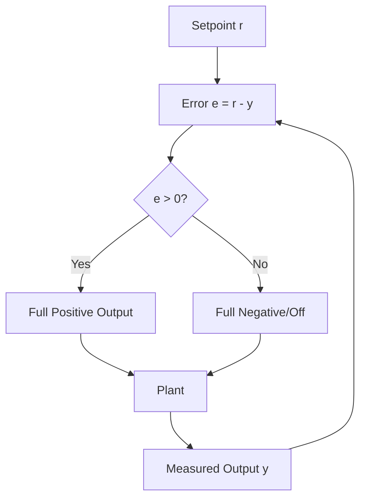
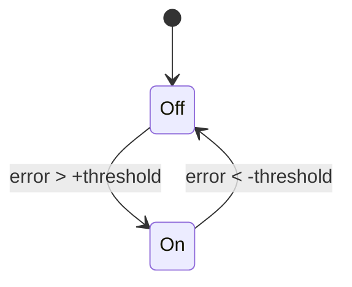

# Bang-Bang Control

Bang-bang (on-off) control switches the actuator fully on or fully off based on the error sign. It's best for systems where precision is not critical or where the plant naturally smooths the control (e.g., with inertia).

## Behavior



### With Hysteresis (Recommended)
Hysteresis prevents rapid on/off chatter near the setpoint by defining a deadband region.



## Pros and Cons

- Pros: Simple, fast to implement, robust to modeling errors
- Cons: Causes oscillation around setpoint, can induce wear, inefficient

## RobotPy Examples

### Simple On/Off
```python
class Shooter(commands2.SubsystemBase):
    def __init__(self):
        super().__init__()
        self.motor = wpilib.PWMSparkMax(3)
    
    def shoot(self):
        self.motor.set(1.0)
    
    def stop(self):
        self.motor.set(0.0)
```

### Bang-Bang with Hysteresis for Velocity
```python
class BangBangVelocity:
    def __init__(self, setpoint_rps: float, threshold: float = 0.5):
        self.setpoint = setpoint_rps
        self.threshold = threshold
    
    def calculate(self, measured_rps: float) -> float:
        error = self.setpoint - measured_rps
        if error > self.threshold:
            return 1.0  # full power
        elif error < -self.threshold:
            return 0.0  # off or negative if bidirectional
        else:
            # within deadband, hold last output or choose strategy
            return 0.0
```

## When to Use Bang-Bang
- Binary mechanisms (solenoids are better but conceptually similar)
- Systems with high inertia (flywheels) as a fallback
- Temporary control when PID tuning is not yet available

For precision tasks, prefer PID or PIDF.
