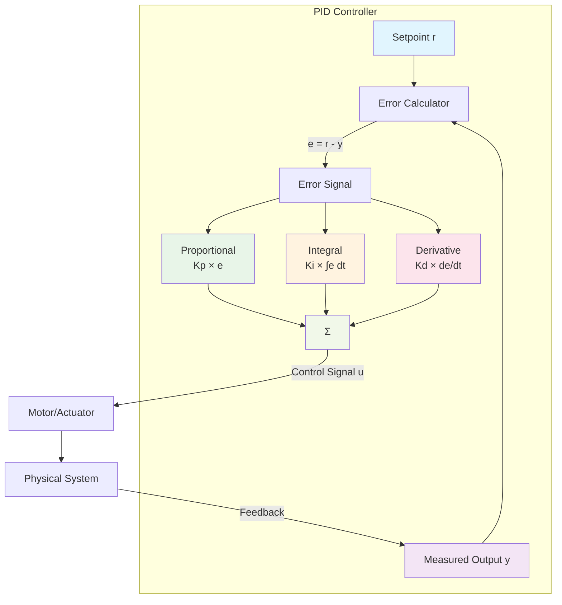
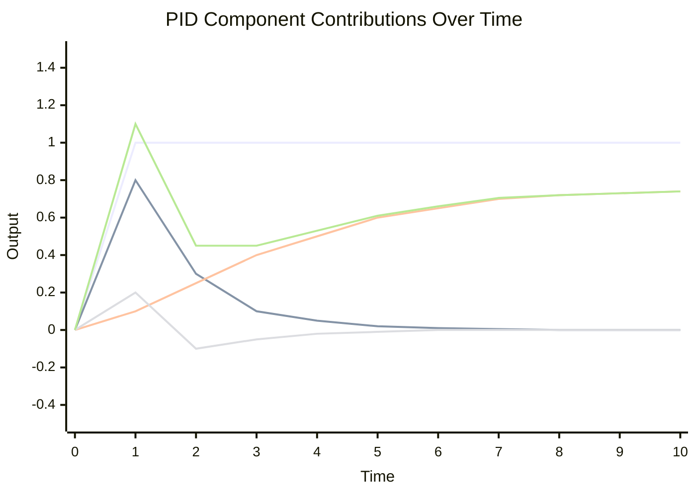
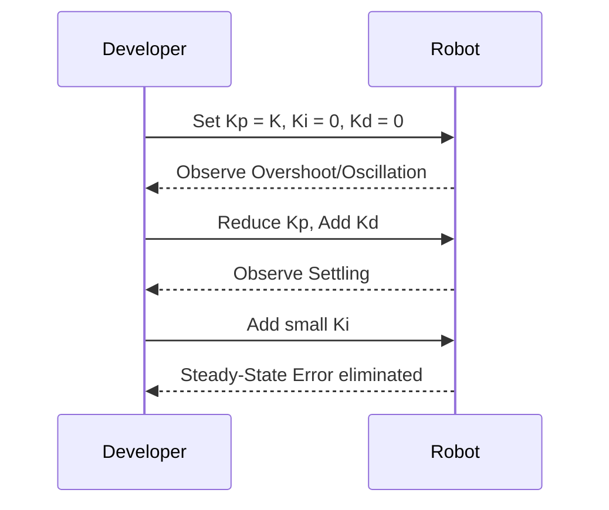

# PID Control

A PID (Proportional-Integral-Derivative) controller is a closed-loop control algorithm that computes a control signal from the error between a desired setpoint and the measured process variable. It's widely used in FRC for positioning mechanisms, regulating flywheel speed, and heading control.

## How PID Works



### PID Response Characteristics



- **Proportional (Kp·e)**: Reacts to present error. Too high → oscillation; too low → sluggish.
- **Integral (Ki·∫e)**: Eliminates steady-state error by accumulating past errors. Too high → windup and overshoot.
- **Derivative (Kd·de/dt)**: Predicts future error to damp oscillations. Too high → noise amplification.

## Tuning Strategy (Practical FRC Approach)

1. Start with Kp only; increase until oscillations begin, then back off 30–50%.
2. Add Kd to reduce overshoot and dampen oscillations.
3. Add Ki slowly to remove steady-state error (watch for windup).
4. Set output limits and integral range to prevent windup.



## Anti-Windup and Practical Considerations

- Set `integrator range` to accumulate I only near the setpoint.
- Clamp controller output to motor limits (e.g., -1 to 1).
- Filter measurement if sensor is noisy (moving average, low-pass).
- Use `atSetpoint()` tolerance instead of exact equality.

## RobotPy Example (Position Control)

```python
import wpilib
import commands2

class Elevator(commands2.SubsystemBase):
    def __init__(self):
        super().__init__()
        self.motor = wpilib.PWMSparkMax(0)
        self.encoder = wpilib.Encoder(0, 1)
        
        self.pid = wpilib.PIDController(kP=0.15, kI=0.0, kD=0.01)
        self.pid.setTolerance(0.02)  # 2 cm tolerance
        self.pid.setIntegratorRange(-0.2, 0.2)  # anti-windup
        
        self.setpoint = 0.0
    
    def periodic(self):
        output = self.pid.calculate(self.encoder.getDistance(), self.setpoint)
        # Clamp output to motor safe range
        output = max(-0.8, min(0.8, output))
        self.motor.set(output)
    
    def goTo(self, height_m):
        self.setpoint = height_m
    
    def atGoal(self):
        return self.pid.atSetpoint()
```

## Common Symptoms and Fixes

| Symptom | Likely Cause | Fix |
|--------|--------------|-----|
| Oscillation | Kp too high, Kd too low | Reduce Kp, increase Kd |
| Slow response | Kp too low | Increase Kp |
| Steady-state error | Ki too low or zero | Add/increase Ki |
| Sudden jumps | Noisy sensor, Kd too high | Filter sensor, reduce Kd |

For more information, see the RobotPy PID controller documentation: [PIDController](https://robotpy.readthedocs.io/en/stable/wpilib/wpilib.controller.PIDController.html)
