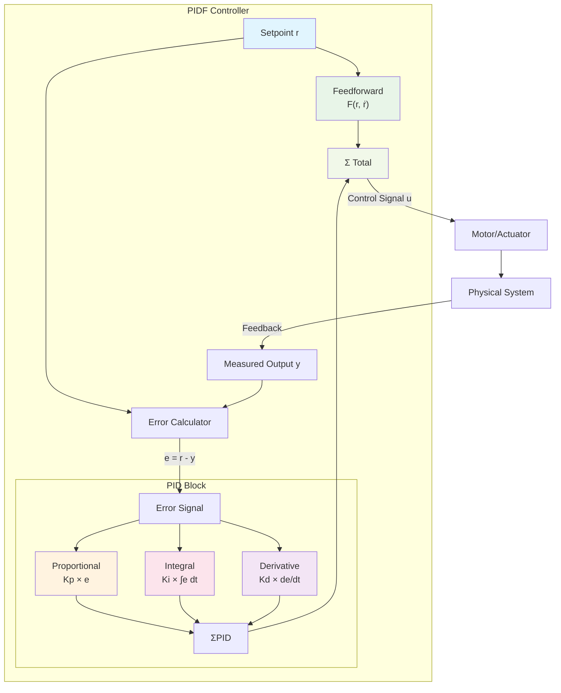
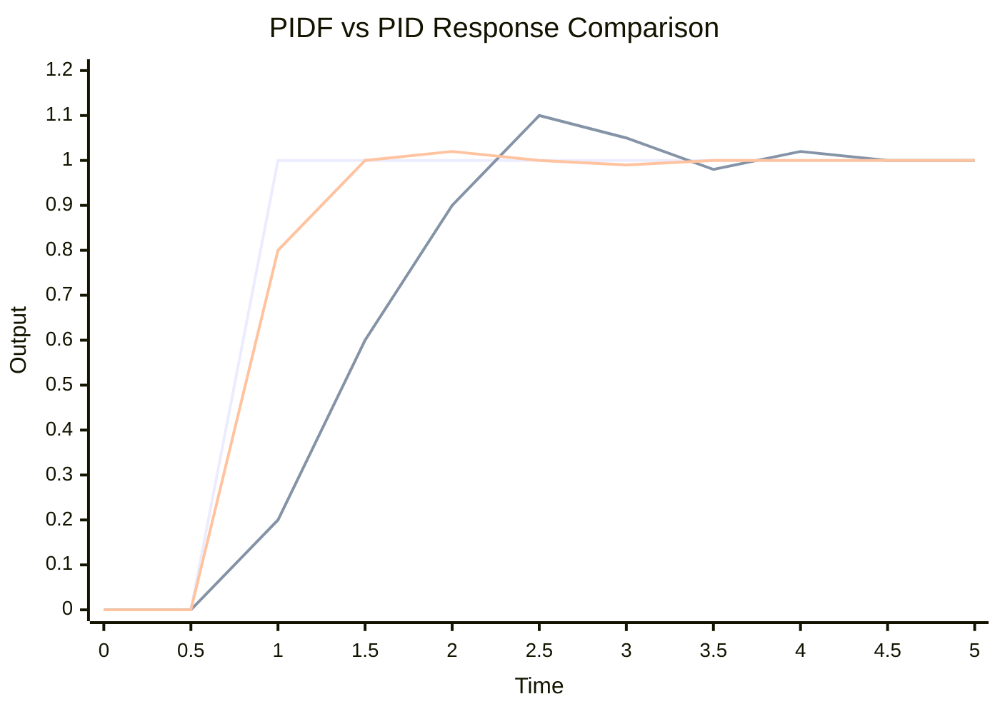
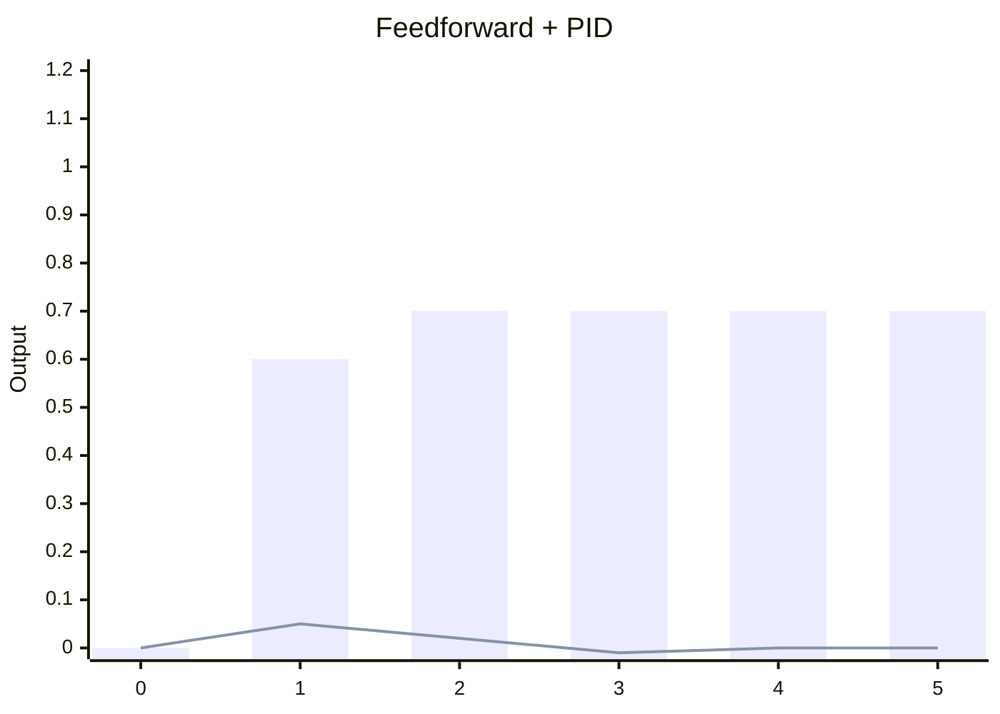

# PIDF (PID + Feedforward)

PIDF adds a feedforward term (F) to standard PID control. Feedforward predicts the required output to achieve a desired setpoint based on a model of the system, while PID corrects residual error. This combination yields faster response and less steady-state error, especially for systems with known dynamics or steady disturbances (like gravity).

## Control Structure



### PIDF vs PID Comparison



- **Feedforward (F)** provides the bulk of the control effort based on system model
- **PID** fine-tunes and corrects for modeling errors and disturbances
- **Result**: Faster response, less overshoot, better tracking

## Common Feedforward Models in FRC

### Velocity Control (Flywheel)
- Model: `u = kS·sgn(v) + kV·v + kA·a`
  - kS: static friction term
  - kV: velocity gain (volts per m/s)
  - kA: acceleration gain (volts per m/s²)

### Position Control (Elevator with Gravity)
- Model: `u = kG + kV·v + kA·a`
  - kG: voltage to hold position against gravity



## Implementing Feedforward in RobotPy

```python
import wpilib
from wpimath.controller import PIDController
from wpimath.controller import SimpleMotorFeedforwardMeters

class Shooter(commands2.SubsystemBase):
    def __init__(self):
        super().__init__()
        self.motor = wpilib.PWMSparkMax(2)
        self.encoder = wpilib.Encoder(4, 5)
        
        # PID on velocity (RPS)
        self.pid = PIDController(0.1, 0.0, 0.001)
        
        # Identify kS, kV, kA via characterization
        self.ff = SimpleMotorFeedforwardMeters(kS=0.2, kV=1.5, kA=0.05)
        
        self.target_rps = 0.0
    
    def setSpeed(self, rps):
        self.target_rps = rps
    
    def periodic(self):
        current_rps = self.encoder.getRate()  # Ensure units match
        
        # Feedforward for desired velocity (assume zero acceleration)
        ff_volts = self.ff.calculate(self.target_rps, 0.0)
        
        # PID correction based on measured velocity
        pid_volts = self.pid.calculate(current_rps, self.target_rps)
        
        volts = ff_volts + pid_volts
        self.motor.setVoltage(volts)
```

## Tuning Workflow

1. Identify feedforward gains via system identification (SysId or manual characterization).
2. Verify the system reaches approximate setpoints with FF alone.
3. Add PID with small Kp to correct steady-state error.
4. Add Kd to damp overshoot; add Ki if residual error remains.

## Choosing Between PID and PIDF

| Scenario | PID | PIDF |
|---------|-----|------|
| Unknown system dynamics | ✓ |  |
| Gravity compensation needed |  | ✓ |
| High-speed response (flywheels) |  | ✓ |
| Minimal tuning time | ✓ |  |

For references:
- WPIMath Feedforward classes
- SysId characterization tool
- PIDController API docs
