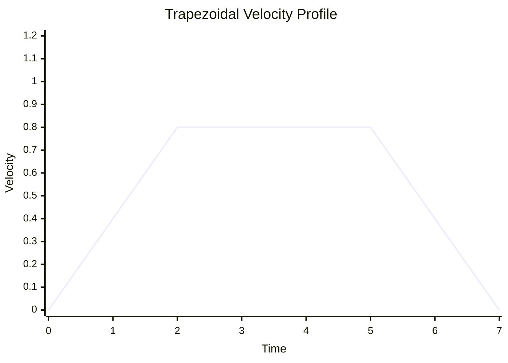
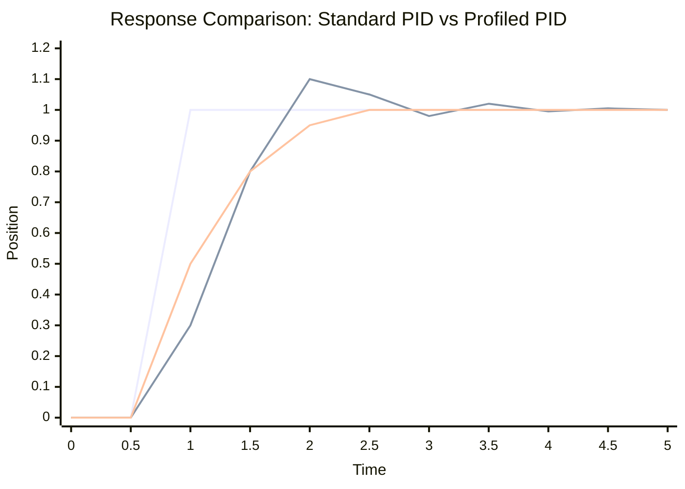

# Trapezoidal Profiled PID Controller

A Trapezoidal Profiled PID controller combines motion profiling with PID control to achieve smooth and constrained motion. Instead of commanding the controller directly to jump to a setpoint, a motion profile generates intermediate goals that respect velocity and acceleration limits.

## Why Use a Profiled PID?

- Smooth motion with limited jerk
- Respects physical constraints (max velocity and acceleration)
- Reduces overshoot by planning motion upfront
- Ideal for mechanisms like elevators, arms, and turrets

## Motion Profile Shape



```mermaid
xychart-beta
    title "Corresponding Position Profile"
    x-axis "Time" [0, 1, 2, 3, 4, 5, 6, 7]
    y-axis "Position" 0 --> 4.0
    line "Position" [0, 0.2, 0.8, 1.6, 2.4, 3.2, 3.8, 4.0]
```

**Profile Phases:**
- **Acceleration phase**: velocity increases linearly up to max
- **Cruise phase**: velocity constant at max
- **Deceleration phase**: velocity decreases linearly to zero

## Control Structure

```mermaid
flowchart TD
    subgraph "Profiled PID Controller"
        A[Target Position r] --> P[Profile Generator]
        P --> |Setpoint (pos, vel)| C[PID Controller]
        Y[Measured pos/vel] --> C
    end
    
    C --> U[Control Output]
    U --> Plant[Mechanism]
    Plant --> |Feedback| Y
    
    style A fill:#e1f5fe
    style P fill:#e8f5e8
    style C fill:#fff3e0
```

## RobotPy Implementation

WPILib provides `ProfiledPIDController` and `TrapezoidProfile.Constraints` for profiled control.

```python
from wpimath.controller import ProfiledPIDController
from wpimath.trajectory import TrapezoidProfile

# Constraints: max velocity (units/s), max acceleration (units/s^2)
constraints = TrapezoidProfile.Constraints(
    maxVelocity=2.0,      # meters per second
    maxAcceleration=1.0   # meters per second^2
)

controller = ProfiledPIDController(
    kP=2.0, kI=0.0, kD=0.2,
    constraints=constraints
)
controller.setTolerance(0.02)  # 2 cm tolerance

# Set the goal position
controller.setGoal(1.5)  # meters

# In your periodic loop:
measurement = elevatorEncoder.getDistance()
output = controller.calculate(measurement)

# Optional: add feedforward based on desired velocity
setpoint = controller.getSetpoint()  # TrapezoidProfile.State(pos, vel)
feedforward = kG + kV * setpoint.velocity
motor.setVoltage(output + feedforward)
```

## Example: Elevator with Gravity Compensation

```python
class Elevator(commands2.SubsystemBase):
    def __init__(self):
        super().__init__()
        self.motor = wpilib.PWMSparkMax(3)
        self.encoder = wpilib.Encoder(0, 1)
        
        self.constraints = TrapezoidProfile.Constraints(1.5, 0.75)
        self.pid = ProfiledPIDController(2.0, 0.0, 0.2, self.constraints)
        self.pid.setTolerance(0.01)  # 1 cm
        
        # Feedforward terms (identify via characterization)
        self.kG = 0.3   # gravity hold voltage
        self.kV = 1.2   # velocity gain
        
        self.goal = 0.0
    
    def setHeight(self, meters: float):
        self.goal = meters
        self.pid.setGoal(meters)
    
    def periodic(self):
        position = self.encoder.getDistance()
        output = self.pid.calculate(position)
        
        # Add velocity feedforward for smoother motion
        sp = self.pid.getSetpoint()  # contains position and velocity
        ff = self.kG + self.kV * sp.velocity
        
        self.motor.setVoltage(output + ff)
    
    def atGoal(self) -> bool:
        return self.pid.atGoal()
```

## Tuning Guidelines

1. Start with motion constraints (max velocity and acceleration) that the mechanism can handle safely.
2. Tune PID gains with moderate constraints to prevent oscillations.
3. Add feedforward terms (kG, kV) to reduce PID effort.
4. Increase constraints gradually as confidence grows.

## Profiled vs Standard PID Response Comparison



**Benefits of Profiled PID:**
- Smoother acceleration and deceleration
- Reduced overshoot and oscillation
- Respects physical constraints
- More predictable motion timing

## Team 1757 Example: Arm Subsystem

Here's how Team 1757 might implement a profiled PID for an arm mechanism:

```python
import commands2
import wpilib
from wpimath.controller import ProfiledPIDController
from wpimath.trajectory import TrapezoidProfile
from wpimath.controller import ArmFeedforward
from constants.arm import (
    kArmMotorId,
    kArmEncoderChannels,
    kArmPIDGains,
    kArmConstraints,
    kArmFeedforwardGains
)

class ArmSubsystem(commands2.SubsystemBase):
    def __init__(self):
        super().__init__()
        self.setName(__class__.__name__)
        
        # Hardware
        self.motor = wpilib.PWMSparkMax(kArmMotorId)
        self.encoder = wpilib.Encoder(*kArmEncoderChannels)
        
        # Motion constraints (rad/s, rad/s^2)
        constraints = TrapezoidProfile.Constraints(
            kArmConstraints.maxVelocity,
            kArmConstraints.maxAcceleration
        )
        
        # Profiled PID controller
        self.pid = ProfiledPIDController(
            kArmPIDGains.kP,
            kArmPIDGains.kI, 
            kArmPIDGains.kD,
            constraints
        )
        self.pid.setTolerance(0.05)  # 0.05 radian tolerance
        
        # Arm feedforward for gravity compensation
        self.feedforward = ArmFeedforward(
            kArmFeedforwardGains.kS,  # Static friction
            kArmFeedforwardGains.kG,  # Gravity
            kArmFeedforwardGains.kV,  # Velocity
            kArmFeedforwardGains.kA   # Acceleration
        )
        
        self.goal_angle = 0.0
    
    def setAngle(self, angle_radians: float):
        """Set target arm angle with profiled motion"""
        self.goal_angle = angle_radians
        self.pid.setGoal(angle_radians)
    
    def periodic(self):
        """Called every robot loop"""
        current_angle = self.encoder.getDistance()
        
        # Get profiled setpoint (position and velocity)
        setpoint = self.pid.getSetpoint()
        
        # Calculate PID output
        pid_output = self.pid.calculate(current_angle)
        
        # Calculate feedforward based on desired position and velocity
        ff_volts = self.feedforward.calculate(
            setpoint.position,  # Desired angle
            setpoint.velocity   # Desired angular velocity
        )
        
        # Combine PID and feedforward
        total_volts = pid_output + ff_volts
        
        # Apply to motor
        self.motor.setVoltage(total_volts)
    
    def atGoal(self) -> bool:
        """Check if arm has reached target position"""
        return self.pid.atGoal()
    
    def getCurrentAngle(self) -> float:
        """Get current arm angle in radians"""
        return self.encoder.getDistance()
```

## Advanced: Custom Profile Generation

For complex motions, you can generate custom profiles:

```python
from wpimath.trajectory import TrapezoidProfile

# Create constraints
constraints = TrapezoidProfile.Constraints(2.0, 1.0)

# Create profile from current state to goal
initial_state = TrapezoidProfile.State(0.0, 0.0)  # pos=0, vel=0
goal_state = TrapezoidProfile.State(1.5, 0.0)     # pos=1.5, vel=0

profile = TrapezoidProfile(constraints, goal_state, initial_state)

# Sample profile at different times
for t in [0, 0.5, 1.0, 1.5, 2.0]:
    state = profile.calculate(t)
    print(f"t={t}: pos={state.position:.2f}, vel={state.velocity:.2f}")
```

## When to Use Profiled PID vs. Standard PID

| Scenario | Standard PID | Profiled PID |
|----------|--------------|--------------|
| Precise positioning w/ smooth motion |  | ✓ |
| Slow, simple mechanisms | ✓ |  |
| Velocity-only control (flywheels) | ✓ |  |
| Elevator/Arm with constraints |  | ✓ |
| High-precision positioning |  | ✓ |
| Systems with backlash | ✓ | ✓ |

## Common Applications in FRC

- **Elevators**: Smooth vertical motion with gravity compensation
- **Arms**: Rotational positioning with inertia considerations  
- **Turrets**: Precise angular positioning for shooting
- **Intakes**: Controlled deployment/retraction
- **Climbers**: Sequential positioning for end-game

For more information, see WPILib's `ProfiledPIDController` and `TrapezoidProfile` documentation.
