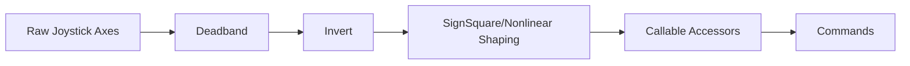

# From Controller to Action

Team 1757 standardizes controller input handling through `operatorinterface.py` and binds those inputs to commands in `robotcontainer.py`. The default drive command uses processed joystick axes (with deadband, inversion, and shaping) and supports field-relative driving with alliance-aware rotation.

## Input Processing Pipeline



### OperatorInterface (OI)
```python
class OperatorInterface:
    class Drive:
        class ChassisControls:
            class Translation:
                y = SignSquare(Invert(Deadband(ControlAxis(0, 1)(), kXboxJoystickDeadband)))
                x = SignSquare(Invert(Deadband(ControlAxis(0, 0)(), kXboxJoystickDeadband)))
            class Rotation:
                y = Invert(Deadband(ControlAxis(1, 1)(), kXboxJoystickDeadband))
                x = Invert(Deadband(ControlAxis(1, 0)(), kXboxJoystickDeadband))
```

## Default Drive Command

```python
self.drive.setDefaultCommand(
    AbsoluteRelativeDrive(
        self.drive,
        lambda: OperatorInterface.Drive.ChassisControls.Translation.y() * kTurboSpeedMultiplier,
        lambda: OperatorInterface.Drive.ChassisControls.Translation.x() * kTurboSpeedMultiplier,
        OperatorInterface.Drive.ChassisControls.Rotation.x,
        OperatorInterface.Drive.ChassisControls.Rotation.y,
    )
)
```

- Field-relative chassis control using alliance-aware orientation
- Rotation target determined by right-stick vector using `atan2(x, y)`
- Rotation PID tracks driver-indicated heading
- Defense state when inputs are within deadband

## Button/Trigger Bindings

```python
def configureButtonBindings(self):
    OperatorInterface.Drive.align_angle().whileTrue(
        AngleAlignDrive(
            self.drive,
            lambda: OperatorInterface.Drive.ChassisControls.Translation.y() * kNormalSpeedMultiplier,
            lambda: OperatorInterface.Drive.ChassisControls.Translation.x() * kNormalSpeedMultiplier,
        ).repeatedly()
    )

    OperatorInterface.Drive.reset_gyro().onTrue(ResetDrive(self.drive, Pose2d(0, 0, 0)))

    OperatorInterface.Drive.defense_state().whileTrue(DefenseState(self.drive))
```

## Driving Modes

- **FieldRelative**: Translation relative to the field, rotation follows driver stick heading
- **RobotRelative**: Translation in robot coordinates (used in DriveDistance)
- **DefenseState**: Locks modules to X pattern when idle for stability

## Best Practices

- Centralize input processing in `OperatorInterface`
- Use lambdas for live sampling of controller values
- Apply deadbands and shaping consistently
- Keep drive command alliance-aware for intuitive control
