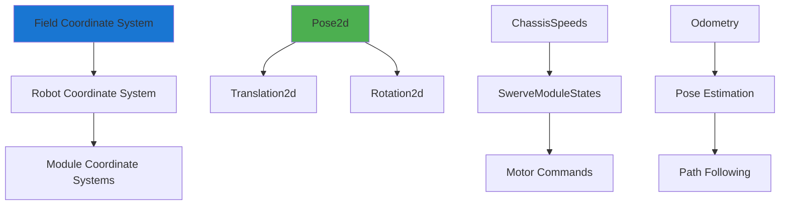

# Geometry

RobotPy provides a variety of geometry classes and utilities that are essential for robot localization, path following, and swerve drive control. These classes handle coordinate transformations between different reference frames.

-   `Translation2d`: Represents a translation in 2D space (x, y).
-   `Rotation2d`: Represents a rotation in 2D space (angle).
-   `Pose2d`: Represents a full pose in 2D space, combining a `Translation2d` and a `Rotation2d`.
-   `Transform2d`: Represents a transformation between two poses.
-   `ChassisSpeeds`: Represents robot velocities (vx, vy, omega).
-   `SwerveModulePosition`: Represents swerve module position (distance, angle).
-   `SwerveModuleState`: Represents swerve module state (velocity, angle).

## Team 1757 Geometry Applications

Team 1757 uses geometry classes extensively for swerve drive control, odometry, and field-relative driving.



### Example: Swerve Drive Odometry

Team 1757 uses odometry to track robot position by integrating swerve module positions and gyro readings:

```python
from wpimath.geometry import Pose2d, Rotation2d, Translation2d
from wpimath.kinematics import SwerveDrive4Odometry, SwerveDrive4Kinematics
from wpimath.kinematics import SwerveModulePosition

class DriveSubsystem:
    def __init__(self):
        # Define swerve module positions relative to robot center
        self.kinematics = SwerveDrive4Kinematics(
            Translation2d(0.238, 0.264),  # Front left
            Translation2d(0.238, -0.264), # Front right
            Translation2d(-0.238, 0.264), # Back left
            Translation2d(-0.238, -0.264) # Back right
        )
        
        # Initialize odometry at origin
        self.odometry = SwerveDrive4Odometry(
            self.kinematics,
            self.getRotation(),  # Current gyro reading
            self.getModulePositions(),  # Current module positions
            Pose2d()  # Starting pose
        )
    
    def getModulePositions(self):
        """Get current swerve module positions"""
        return (
            self.frontLeftModule.getPosition(),
            self.frontRightModule.getPosition(), 
            self.backLeftModule.getPosition(),
            self.backRightModule.getPosition(),
        )
    
    def periodic(self):
        """Update odometry every robot loop"""
        self.odometry.update(
            self.getRotation(),
            self.getModulePositions()
        )
    
    def getPose(self) -> Pose2d:
        """Get current robot pose from odometry"""
        return self.odometry.getPose()
```

### Example: Field-Relative to Robot-Relative Conversion

For field-relative driving, Team 1757 converts driver inputs from field coordinates to robot coordinates:

```python
from wpimath.kinematics import ChassisSpeeds
from wpimath.geometry import Rotation2d
from wpilib import DriverStation
from math import pi

class AbsoluteRelativeDrive:
    def execute(self):
        # Get field-relative speeds from driver
        forward = self.forward()  # Field forward/backward
        sideways = self.sideways()  # Field left/right
        rotation = self.rotation()  # Rotation about field Z
        
        # Alliance-aware field-relative conversion
        if DriverStation.getAlliance() == DriverStation.Alliance.kRed:
            # Red alliance faces opposite direction
            chassisSpeeds = ChassisSpeeds.fromFieldRelativeSpeeds(
                -forward,  # Flip forward
                -sideways, # Flip sideways
                rotation,
                self.drive.getRotation()  # Current robot heading
            )
        else:
            chassisSpeeds = ChassisSpeeds.fromFieldRelativeSpeeds(
                forward,
                sideways, 
                rotation,
                self.drive.getRotation()
            )
        
        # Convert chassis speeds to module states
        moduleStates = self.drive.kinematics.toSwerveModuleStates(chassisSpeeds)
        self.drive.applyStates(moduleStates)
```

### Example: Pose Estimation with Vision Fusion

Team 1757 uses pose estimation to fuse odometry with vision measurements for improved accuracy:

```python
from wpimath.estimator import SwerveDrive4PoseEstimator
from wpimath.geometry import Pose2d, Rotation2d
from wpilib import Timer
from constants.math import kRadiansPerDegree

class RobotPoseEstimator:
    def __init__(self, kinematics, gyroAngle, modulePositions, initialPose):
        # Standard deviations for odometry (x, y, heading)
        self.odometryStdDevs = (0.05, 0.05, 5 * kRadiansPerDegree)
        
        # Standard deviations for vision (x, y, heading)
        self.visionStdDevs = (0.1, 0.1, 10 * kRadiansPerDegree)
        
        self.estimator = SwerveDrive4PoseEstimator(
            kinematics,
            gyroAngle,
            modulePositions,
            initialPose,
            self.odometryStdDevs,
            self.visionStdDevs
        )
    
    def addOdometryMeasurement(self, modulePositions, gyroAngle, timestamp):
        """Add odometry measurement"""
        self.estimator.update(gyroAngle, modulePositions)
    
    def addVisionMeasurement(self, visionPose: Pose2d, timestamp: float):
        """Add vision measurement with timestamp"""
        # Only accept reasonable vision measurements
        if self.isVisionMeasurementValid(visionPose):
            self.estimator.addVisionMeasurement(visionPose, timestamp)
    
    def isVisionMeasurementValid(self, visionPose: Pose2d) -> bool:
        """Validate vision measurement before using"""
        # Check if pose is within field boundaries
        if (abs(visionPose.X()) > 16.5 or  # Field is ~16.5m long
            abs(visionPose.Y()) > 8.2):     # Field is ~8.2m wide
            return False
            
        # Check if pose is reasonable compared to current estimate
        currentPose = self.estimator.getEstimatedPosition()
        distance = currentPose.translation().distance(visionPose.translation())
        
        # Reject measurements that are too far from current estimate
        return distance < 2.0  # 2 meters maximum jump
    
    @property
    def estimatedPose(self) -> Pose2d:
        return self.estimator.getEstimatedPosition()
```

### Example: Distance and Angle Calculations

Common geometric calculations for autonomous routines and alignment:

```python
from wpimath.geometry import Pose2d, Translation2d, Rotation2d
from math import atan2, sqrt

def calculate_distance_to_target(robotPose: Pose2d, targetPose: Pose2d) -> float:
    """Calculate distance between robot and target"""
    return robotPose.translation().distance(targetPose.translation())

def calculate_angle_to_target(robotPose: Pose2d, targetTranslation: Translation2d) -> Rotation2d:
    """Calculate angle robot needs to face to point at target"""
    dx = targetTranslation.X() - robotPose.X()
    dy = targetTranslation.Y() - robotPose.Y()
    return Rotation2d(atan2(dy, dx))

def is_robot_facing_target(robotPose: Pose2d, targetTranslation: Translation2d, tolerance: float) -> bool:
    """Check if robot is facing target within tolerance"""
    targetAngle = calculate_angle_to_target(robotPose, targetTranslation)
    angleDifference = abs(robotPose.rotation().radians() - targetAngle.radians())
    return angleDifference < tolerance

# Usage in autonomous command
class AlignToTarget(Command):
    def __init__(self, drive, targetPose: Pose2d):
        self.drive = drive
        self.targetPose = targetPose
        
    def execute(self):
        currentPose = self.drive.getPose()
        
        # Calculate desired heading to face target
        targetHeading = calculate_angle_to_target(currentPose, self.targetPose.translation())
        
        # Use PID to rotate to target heading
        rotationSpeed = self.rotationPID.calculate(
            currentPose.rotation().radians(),
            targetHeading.radians()
        )
        
        # Drive while rotating
        self.drive.arcadeDriveWithFactors(0, 0, rotationSpeed, 
                                          DriveSubsystem.CoordinateMode.RobotRelative)
    
    def isFinished(self) -> bool:
        return is_robot_facing_target(
            self.drive.getPose(), 
            self.targetPose.translation(), 
            0.1  # 0.1 radian tolerance
        )
```

### Example: Transform Operations

Using transforms to manipulate poses and plan robot movements:

```python
from wpimath.geometry import Pose2d, Transform2d, Translation2d, Rotation2d

# Create a transform to move 1 meter forward
forward_transform = Transform2d(Translation2d(1.0, 0.0), Rotation2d())

# Apply transform to current pose to get target pose
current_pose = Pose2d(2.0, 3.0, Rotation2d.fromDegrees(45))
target_pose = current_pose + forward_transform

print(f"Current: {current_pose}")
print(f"Target: {target_pose}")

# Calculate transform between two poses
pose_a = Pose2d(1.0, 1.0, Rotation2d.fromDegrees(0))
pose_b = Pose2d(3.0, 2.0, Rotation2d.fromDegrees(90))
transform_a_to_b = pose_b - pose_a

# Verify: pose_a + transform should equal pose_b
verify_pose = pose_a + transform_a_to_b
print(f"Verification: {verify_pose} == {pose_b}")
```

## Coordinate System Best Practices

### Field Coordinate System
- Origin at blue alliance driver station wall
- X-axis points toward red alliance
- Y-axis points toward left side of field (from blue alliance perspective)
- Angles measured counter-clockwise from X-axis

### Robot Coordinate System
- Origin at robot center
- X-axis points forward (robot front)
- Y-axis points left
- Rotation about Z-axis (vertical)

### Alliance Awareness
Team 1757 handles alliance color by flipping field-relative coordinates for red alliance:

```python
def get_alliance_relative_pose(field_pose: Pose2d) -> Pose2d:
    """Convert field pose to alliance-relative pose"""
    if DriverStation.getAlliance() == DriverStation.Alliance.kRed:
        # Flip X and Y, rotate 180 degrees
        return Pose2d(
            -field_pose.X(),
            -field_pose.Y(), 
            field_pose.rotation() + Rotation2d(pi)
        )
    return field_pose
```

For more information, see the RobotPy geometry documentation: [https://robotpy.readthedocs.io/en/stable/wpilib/wpilib.geometry.html](https://robotpy.readthedocs.io/en/stable/wpilib/wpilib.geometry.html)
