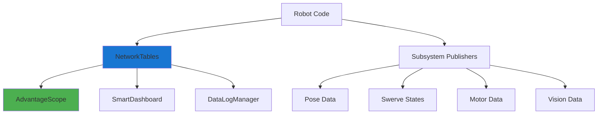

# NetworkTables

NetworkTables is a key-value store that is used for communication between the robot and other computers, such as the driver station or a co-processor. It is a simple and easy-to-use way to send and receive data, and it is used extensively in FRC for a variety of purposes, such as:

-   Sending data from the robot to the driver station for display.
-   Sending commands from the driver station to the robot.
-   Sending data from a co-processor to the robot for processing.
-   Logging structured data for analysis and debugging.
-   Real-time visualization in tools like AdvantageScope.

Data is organized in tables, and can be structured using sub-tables.

## Team 1757 NetworkTables Architecture

Team 1757 uses a structured approach to NetworkTables that supports both real-time monitoring and post-match analysis. The architecture emphasizes type safety, organized data hierarchy, and AdvantageScope compatibility.



### Example: Basic Read/Write

This shows writing a value from the robot and reading it back.

```python
from networktables import NetworkTables

# Initialize NetworkTables (on the robot, this is often done for you)
NetworkTables.initialize()

# Get the default table, which is "SmartDashboard"
# table = NetworkTables.getTable("SmartDashboard")

# It's good practice to put your data in a sub-table
robot_status_table = NetworkTables.getTable("RobotStatus")

# Write a value to the table
robot_status_table.putNumber("batteryVoltage", 12.5)

# Read a value from the table, providing a default value
voltage = robot_status_table.getNumber("batteryVoltage", 0)
```

### Example: Listening for Changes

You can also listen for changes to values, which is useful for dashboards or co-processors that need to react to robot state changes.

This example would run on a co-processor or dashboard computer.

```python
from networktables import NetworkTables

# Initialize NetworkTables, connecting to the robot
NetworkTables.initialize(server='roborio-1757-frc.local')

dashboard_table = NetworkTables.getTable("SmartDashboard")
arm_table = dashboard_table.getSubTable("Arm")

def arm_setpoint_changed(table, key, value, isNew):
    if key == "setpoint":
        print(f"Arm setpoint changed to: {value}")
        # In a real application, you might use this to update a display

# Add a listener to the "setpoint" key in the "Arm" table
arm_table.addEntryListener(arm_setpoint_changed, key="setpoint")

# The robot code would write to this entry to change the setpoint
# arm_table.putNumber("setpoint", 90)

# Keep the script running to listen for changes
import time
while True:
    time.sleep(1)
```

## Team 1757 Structured Logging Patterns

### Swerve Drive State Logging

Team 1757 uses structured NetworkTables topics for logging complex data types like swerve module states:

```python
from ntcore import NetworkTableInstance
from wpimath.kinematics import SwerveModuleState
from wpimath.geometry import Pose2d
from constants.logging import kSwerveActualStatesKey, kSwerveExpectedStatesKey

class DriveSubsystem(Subsystem):
    def __init__(self):
        # ... other initialization ...
        
        # Create structured topic publishers for AdvantageScope
        nt = NetworkTableInstance.getDefault()
        
        self.swerveStatePublisher = nt.getStructArrayTopic(
            kSwerveActualStatesKey, SwerveModuleState
        ).publish()
        
        self.swerveStateExpectedPublisher = nt.getStructArrayTopic(
            kSwerveExpectedStatesKey, SwerveModuleState
        ).publish()
        
        self.robotPosePublisher = nt.getStructTopic(
            "/robot/pose", Pose2d
        ).publish()

    def periodic(self):
        """Log data every robot loop"""
        # Publish actual swerve module states
        actualStates = [
            self.frontLeftModule.getState(),
            self.frontRightModule.getState(),
            self.backLeftModule.getState(),
            self.backRightModule.getState(),
        ]
        self.swerveStatePublisher.set(actualStates)
        
        # Publish robot pose
        self.robotPosePublisher.set(self.getPose())

    def applyStates(self, moduleStates):
        """Log expected states when applying new commands"""
        frontLeft, frontRight, backLeft, backRight = \
            SwerveDrive4Kinematics.desaturateWheelSpeeds(
                moduleStates, kMaxWheelLinearVelocity
            )
        
        # Log what we're commanding the modules to do
        self.swerveStateExpectedPublisher.set(
            [frontLeft, frontRight, backLeft, backRight]
        )
        
        # Apply the states to hardware
        self.frontLeftModule.applyState(frontLeft)
        # ... apply to other modules
```

### Constants-Based Key Organization

Team 1757 centralizes NetworkTables keys in constants for maintainability:

```python
# constants/logging.py
from util.keyorganization import OptionalValueKeys

kSwerveActualStatesKey = "/swerve/actual_states"
kSwerveExpectedStatesKey = "/swerve/expected_states"

kRobotPoseArrayKeys = OptionalValueKeys(
    "/robot/pose",
    "/robot/pose_valid"
)

kDriveVelocityKeys = "/drive/chassis_speeds"
```

### Multi-Value Key Organization

For related data that needs validity flags, Team 1757 uses structured key organization:

```python
# util/keyorganization.py
class OptionalValueKeys:
    def __init__(self, valueKey: str, validKey: str):
        self.valueKey = valueKey
        self.validKey = validKey

# Usage in subsystem
class DriveSubsystem(Subsystem):
    def __init__(self):
        nt = NetworkTableInstance.getDefault()
        
        self.robotPosePublisher = nt.getStructTopic(
            kRobotPoseArrayKeys.valueKey, Pose2d
        ).publish()
        
        self.robotPoseValidPublisher = nt.getBooleanTopic(
            kRobotPoseArrayKeys.validKey
        ).publish()
        
        # Mark pose as valid by default
        self.robotPoseValidPublisher.set(True)

    def periodic(self):
        pose = self.getPose()
        
        # Only publish if pose is reasonable
        if self.isPoseValid(pose):
            self.robotPosePublisher.set(pose)
            self.robotPoseValidPublisher.set(True)
        else:
            self.robotPoseValidPublisher.set(False)
```

### Data Logging Integration

Team 1757 integrates NetworkTables with WPILib's data logging system:

```python
# robotcontainer.py
import wpilib

class RobotContainer:
    def __init__(self):
        # ... subsystem initialization ...
        
        # Start data logging to USB drive/file system
        wpilib.DataLogManager.start()
        
        # Log NetworkTables data automatically
        wpilib.DataLogManager.logNetworkTables(True)
        
        # Start driver station logging
        wpilib.DriverStation.startDataLog(wpilib.DataLogManager.getLog())
        
        # Suppress joystick warnings in logs
        wpilib.DriverStation.silenceJoystickConnectionWarning(True)
```

### AdvantageScope Compatibility

Team 1757's logging is designed for AdvantageScope visualization:

```python
# Structured arrays for module states
swerveStates = [SwerveModuleState(), ...] # Array of 4 states
self.swerveStatePublisher.set(swerveStates)

# Pose data with timestamps
pose = Pose2d(x, y, rotation)
self.robotPosePublisher.set(pose)

# Chassis speeds for velocity visualization
chassisSpeed = ChassisSpeeds(vx, vy, omega)
self.driveVelocityPublisher.set(chassisSpeed)
```

### Vision Integration Logging

For vision-based pose estimation, Team 1757 logs both odometry and vision data:

```python
class VisionSubsystem(Subsystem):
    def __init__(self):
        nt = NetworkTableInstance.getDefault()
        self.visionPosePublisher = nt.getStructTopic(
            "/vision/robot_pose", Pose2d
        ).publish()
        self.visionValidPublisher = nt.getBooleanTopic(
            "/vision/pose_valid"
        ).publish()

    def periodic(self):
        result = self.camera.getLatestResult()
        if result.hasTargets():
            pose = result.getBestTarget().getBestCameraToTarget()
            self.visionPosePublisher.set(pose)
            self.visionValidPublisher.set(True)
        else:
            self.visionValidPublisher.set(False)
```

## Key Benefits of Team 1757's Approach

1. **Type Safety**: Using struct topics prevents data corruption and provides better tooling support
2. **Organized Hierarchy**: Clear naming conventions make data easy to find in logs
3. **Tool Integration**: Direct compatibility with AdvantageScope for analysis
4. **Validity Tracking**: Separate flags indicate when data is reliable
5. **Performance**: Efficient binary serialization for complex data types
6. **Maintainability**: Constants-based organization makes refactoring easier

For more information, see the RobotPy NetworkTables documentation: [https://robotpy.readthedocs.io/en/stable/networktables/networktables.html](https://robotpy.readthedocs.io/en/stable/networktables/networktables.html)
