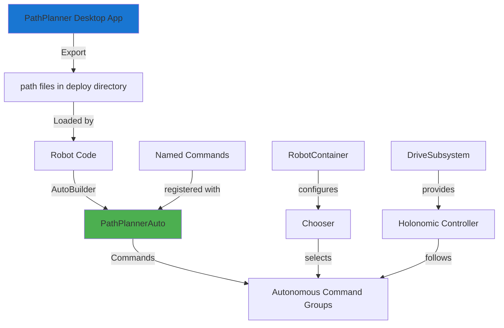
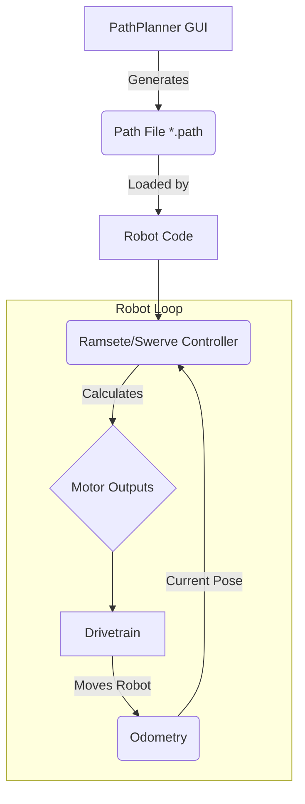

# PathPlanner

PathPlanner is a powerful tool used to create, visualize, and execute autonomous paths for FRC robots. Team 1757 uses PathPlanner extensively for complex autonomous routines and integrates it with their swerve drive control system.

## Team 1757 PathPlanner Architecture

Team 1757 uses the latest PathPlanner version with AutoBuilder integration for simplified autonomous routines. The system combines pre-planned paths with dynamically generated waypoints and alliance-aware positioning.





To use PathPlanner with RobotPy, you need to install the `pathplannerlib` library:
`pip install pathplannerlib`

### Team 1757 AutoBuilder Configuration

Team 1757 configures PathPlanner's AutoBuilder in the drive subsystem for seamless path following:

```python
from pathplannerlib.auto import AutoBuilder
from pathplannerlib.controller import PPHolonomicDriveController
from pathplannerlib.path import RobotConfig
from wpilib import DriverStation
from constants.trajectory import (
    kPathFollowingTranslationConstantsAuto,
    kPathFollowingRotationConstants,
)

class DriveSubsystem(Subsystem):
    def __init__(self):
        # ... other initialization ...
        
        # Load robot configuration from GUI settings
        self.config = RobotConfig.fromGUISettings()
        
        # Configure AutoBuilder with Team 1757's drive methods
        AutoBuilder.configure(
            self.getPose,                    # Function to get current pose
            self.resetDriveAtPosition,       # Function to reset pose
            self.getRobotRelativeSpeeds,     # Function to get current speeds
            self.drivePathPlanned,           # Function to drive with speeds
            PPHolonomicDriveController(      # Path following controller
                kPathFollowingTranslationConstantsAuto,  # Translation PID
                kPathFollowingRotationConstants,         # Rotation PID
            ),
            self.config,                     # Robot configuration
            # Alliance color supplier for path mirroring
            lambda: DriverStation.getAlliance() == DriverStation.Alliance.kRed,
            self,                            # Drive subsystem reference
        )
    
    def drivePathPlanned(self, chassisSpeeds: ChassisSpeeds, _feedForward):
        """Drive method called by PathPlanner"""
        return self.arcadeDriveWithSpeeds(
            chassisSpeeds, 
            DriveSubsystem.CoordinateMode.RobotRelative
        )
```

### Team 1757 Autonomous Command Setup

In RobotContainer, Team 1757 dynamically loads all PathPlanner autonomous files:

```python
import os
from commands2.waitcommand import WaitCommand
from pathplannerlib.auto import PathPlannerAuto, NamedCommands
import wpilib

class RobotContainer:
    def __init__(self):
        # ... subsystem initialization ...
        
        # Register named commands for PathPlanner events
        NamedCommands.registerCommand("exampleWait", WaitCommand(2))
        # NamedCommands.registerCommand("intakeOn", IntakeCommand(self.intake))
        # NamedCommands.registerCommand("shoot", ShootCommand(self.shooter))
        
        # Create autonomous chooser
        self.chooser = wpilib.SendableChooser()
        
        # Dynamically load all PathPlanner auto files
        pathsPath = os.path.join(wpilib.getDeployDirectory(), "pathplanner", "autos")
        for file in os.listdir(pathsPath):
            if file.endswith('.auto'):
                relevantName = file.split(".")[0]  # Remove .auto extension
                auton = PathPlannerAuto(relevantName)
                
                # Add to both chooser and SmartDashboard
                self.chooser.addOption(relevantName, auton)
                wpilib.SmartDashboard.putData(f"autos/{relevantName}", auton)
        
        # Simple autonomous fallback
        self.simpleAuto = commands2.SequentialCommandGroup(
            ResetDrive(self.drive),
            DriveDistance(
                -4 * kWheelCircumference, 0.2,
                DriveDistance.Axis.X, self.drive,
            ),
        )
        
        # Add simple auto options
        self.chooser.addOption("Do Nothing Auto", self.nothingAuto)
        self.chooser.setDefaultOption("Simple Auto", self.simpleAuto)
        
        # Put chooser on dashboard
        wpilib.SmartDashboard.putData("Autonomous", self.chooser)
    
    def getAutonomousCommand(self) -> commands2.Command:
        return self.chooser.getSelected()
```

### Named Commands Integration

Team 1757 uses named commands to trigger subsystem actions during autonomous paths:

```python
# Register subsystem commands that can be called from PathPlanner
NamedCommands.registerCommand("resetDrive", 
    ResetDrive(self.drive, Pose2d(0, 0, 0))
)
NamedCommands.registerCommand("defenseState", 
    DefenseState(self.drive)
)
NamedCommands.registerCommand("waitTwoSeconds", 
    WaitCommand(2.0)
)

# In PathPlanner GUI, you can add event markers that trigger these commands
# at specific points along the path
```

### Alliance Color Handling

PathPlanner automatically handles alliance color by mirroring paths when on red alliance. Team 1757 configures this in AutoBuilder:

```python
# Lambda function returns True for red alliance, causing path mirroring
lambda: DriverStation.getAlliance() == DriverStation.Alliance.kRed
```

### Robot Configuration

Team 1757 defines robot physical parameters for PathPlanner path generation:

```python
# In PathPlanner GUI settings or robot config
# - Robot mass and MOI for trajectory generation
# - Module locations for swerve drive kinematics
# - Max velocities and accelerations
# - Wheel friction coefficients
```

For more information, see the PathPlanner documentation: [https://github.com/mjansen4857/pathplanner/wiki](https://github.com/mjansen4857/pathplanner/wiki)
