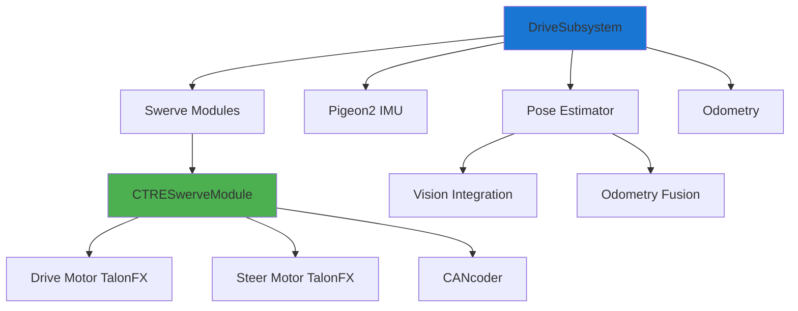

# Subsystems

A subsystem is a Python class that represents a specific part of the robot, such as the drivetrain, intake, or shooter. Subsystems are responsible for controlling the hardware associated with that part of the robot and for providing a high-level interface for other parts of the code to interact with it.

By encapsulating the hardware control and logic for each part of the robot in a separate subsystem, you can make your code more organized, modular, and easier to maintain.

## Team 1757 Subsystem Architecture

Team 1757 uses a modular subsystem design with clear separation of concerns. Each subsystem inherits from `commands2.Subsystem` and follows consistent patterns for hardware abstraction and state management.



### Example: Swerve Drive Subsystem

Team 1757's drive subsystem demonstrates modern FRC robotics patterns including swerve drive, pose estimation, and NetworkTables logging.

```python
from enum import Enum, auto
from commands2 import Subsystem
from phoenix6.hardware.pigeon2 import Pigeon2
from wpimath.geometry import Pose2d, Rotation2d, Translation2d
from wpimath.kinematics import (
    ChassisSpeeds,
    SwerveDrive4Kinematics,
    SwerveDrive4Odometry,
)
from ntcore import NetworkTableInstance

from subsystems.drive.ctreswervemodule import CTRESwerveModule
from subsystems.drive.robotposeestimator import RobotPoseEstimator
from constants.drive import (
    kFrontLeftWheelPosition,
    kFrontRightWheelPosition,
    kBackLeftWheelPosition,
    kBackRightWheelPosition,
    kPigeonCANId,
    kCANivoreName,
    # Module configurations...
)

class DriveSubsystem(Subsystem):
    class CoordinateMode(Enum):
        RobotRelative = auto()
        FieldRelative = auto()

    def __init__(self) -> None:
        Subsystem.__init__(self)
        self.setName(__class__.__name__)

        # Initialize four swerve modules
        self.frontLeftModule = CTRESwerveModule("front_left", ...)
        self.frontRightModule = CTRESwerveModule("front_right", ...)
        self.backLeftModule = CTRESwerveModule("back_left", ...)
        self.backRightModule = CTRESwerveModule("back_right", ...)
        
        self.modules = (
            self.frontLeftModule,
            self.frontRightModule, 
            self.backLeftModule,
            self.backRightModule,
        )

        # Swerve kinematics for coordinate transformations
        self.kinematics = SwerveDrive4Kinematics(
            kFrontLeftWheelPosition,
            kFrontRightWheelPosition,
            kBackLeftWheelPosition,
            kBackRightWheelPosition,
        )

        # Pigeon2 IMU for heading measurement
        self.gyro = Pigeon2(kPigeonCANId, kCANivoreName)
        
        # Pose estimator fuses odometry with vision data
        self.estimator = RobotPoseEstimator(
            self.kinematics,
            self.getRotation(),
            self.getModulePositions(),
            Pose2d(),
            (0.05, 0.05, 0.087), # Standard deviations [x, y, heading]
        )

        # Basic odometry for comparison/fallback
        self.odometry = SwerveDrive4Odometry(
            self.kinematics,
            self.getRotation(),
            self.getModulePositions(),
            Pose2d(),
        )

        # NetworkTables publishers for logging and visualization
        self.setupNetworkTables()

    def setupNetworkTables(self):
        nt = NetworkTableInstance.getDefault()
        self.robotPosePublisher = nt.getStructTopic(
            "/robot/pose", Pose2d
        ).publish()
        self.swerveStatePublisher = nt.getStructArrayTopic(
            "/swerve/actual_states", SwerveModuleState
        ).publish()

    def defenseState(self):
        """Lock wheels in X pattern for defense"""
        self.frontLeftModule.setSwerveAngleTarget(Rotation2d.fromDegrees(45))
        self.frontRightModule.setSwerveAngleTarget(Rotation2d.fromDegrees(-45))
        self.backLeftModule.setSwerveAngleTarget(Rotation2d.fromDegrees(135))
        self.backRightModule.setSwerveAngleTarget(Rotation2d.fromDegrees(-135))
        for module in self.modules:
            module.setWheelLinearVelocityTarget(0)

    def getModulePositions(self):
        return (
            self.frontLeftModule.getPosition(),
            self.frontRightModule.getPosition(),
            self.backLeftModule.getPosition(),
            self.backRightModule.getPosition(),
        )

    def getModuleStates(self):
        return (
            self.frontLeftModule.getState(),
            self.frontRightModule.getState(),
            self.backLeftModule.getState(),
            self.backRightModule.getState(),
        )

    def getRotation(self) -> Rotation2d:
        return Rotation2d.fromDegrees(self.gyro.get_yaw().value)

    def getPose(self) -> Pose2d:
        """Get current robot pose from pose estimator"""
        return self.estimator.estimatedPose

    def arcadeDriveWithSpeeds(
        self, chassisSpeeds: ChassisSpeeds, coordinateMode: CoordinateMode
    ) -> None:
        """Drive with chassis speeds in robot or field-relative coordinates"""
        if coordinateMode == self.CoordinateMode.FieldRelative:
            robotSpeeds = ChassisSpeeds.fromFieldRelativeSpeeds(
                chassisSpeeds.vx,
                chassisSpeeds.vy,
                chassisSpeeds.omega,
                self.getRotation(),
            )
        else:
            robotSpeeds = chassisSpeeds

        # Convert to module states and apply
        moduleStates = self.kinematics.toSwerveModuleStates(robotSpeeds)
        self.applyStates(moduleStates)

    def applyStates(self, moduleStates):
        """Apply swerve module states with velocity saturation"""
        frontLeft, frontRight, backLeft, backRight = \
            SwerveDrive4Kinematics.desaturateWheelSpeeds(
                moduleStates, kMaxWheelLinearVelocity
            )
        
        self.frontLeftModule.applyState(frontLeft)
        self.frontRightModule.applyState(frontRight)
        self.backLeftModule.applyState(backLeft)
        self.backRightModule.applyState(backRight)

    def resetDriveAtPosition(self, pose: Pose2d):
        """Reset odometry and pose estimator to given position"""
        self.odometry.resetPosition(
            self.getRotation(),
            self.getModulePositions(),
            pose,
        )
        self.estimator.resetPosition(
            self.getRotation(),
            self.getModulePositions(), 
            pose,
        )

    def periodic(self):
        """Called every robot loop - update odometry and logging"""
        # Update odometry with current sensor readings
        self.odometry.update(self.getRotation(), self.getModulePositions())
        
        # Update pose estimator (handles vision fusion internally)
        self.estimator.addOdometryMeasurement(
            self.getModulePositions(),
            self.getRotation(),
            Timer.getFPGATimestamp()
        )
        
        # Publish data to NetworkTables
        self.robotPosePublisher.set(self.getPose())
        self.swerveStatePublisher.set(list(self.getModuleStates()))
```

## Key Patterns in Team 1757 Subsystems

### 1. Modular Hardware Abstraction
- Swerve modules encapsulate drive/steer motor control
- Clear interfaces between hardware and control logic
- Consistent naming conventions and parameter organization

### 2. Coordinate System Management
- Explicit robot-relative vs field-relative coordinate modes
- Alliance-aware transformations for consistent driver experience
- Proper handling of rotation and translation coupling

### 3. State Management
- Defensive states for robot stability
- Pose estimation with sensor fusion
- Odometry reset and calibration procedures

### 4. Logging and Visualization
- NetworkTables integration for real-time data
- AdvantageScope compatibility for debugging
- Structured data publishing for analysis

### 5. Robust Periodic Methods
- Consistent sensor reading and state updates
- Proper timing considerations for control loops
- Error handling and graceful degradation
