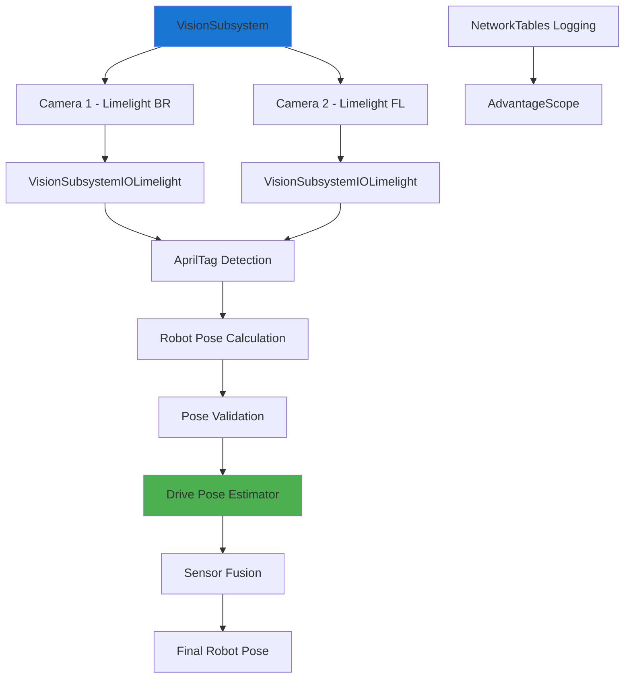

# Vision Integration

Team 1757 uses vision systems extensively for robot localization, pose estimation, and autonomous alignment. The vision subsystem integrates multiple cameras with the drive subsystem's pose estimator to provide accurate field positioning.

## Team 1757 Vision Architecture

Team 1757's vision system supports multiple camera types and provides a unified interface for pose estimation and field localization.



### Vision Subsystem Structure

Team 1757 uses an IO-based architecture that supports different camera types through a common interface:

```python
from typing import Optional
from commands2 import Subsystem
from ntcore import NetworkTableInstance
from wpilib import RobotBase
from wpimath.geometry import Pose2d, Pose3d

from subsystems.vision.visionio import VisionSubsystemIO
from subsystems.vision.visioniolimelight import VisionSubsystemIOLimelight
from subsystems.vision.visioniosim import VisionSubsystemIOSim

class VisionSubsystem(Subsystem):
    def __init__(self, drive: DriveSubsystem) -> None:
        Subsystem.__init__(self)
        self.setName(__class__.__name__)
        
        self.drive = drive
        
        # NetworkTables publishers for logging
        self.setupNetworkTables()
        
        # Initialize cameras based on environment
        if RobotBase.isReal():
            self.camera1 = VisionSubsystemIOLimelight(
                "limelight-br", kRobotToCamera1Transform
            )
            self.camera2 = VisionSubsystemIOLimelight(
                "limelight-fl", kRobotToCamera2Transform
            )
        else:
            self.camera1 = VisionSubsystemIOSim("limelight1", kRobotToCamera1Transform)
            self.camera2 = VisionSubsystemIOSim("limelight2", kRobotToCamera2Transform)
        
        # Update camera positions
        self.camera1.updateCameraPosition(kRobotToCamera1Transform)
        self.camera2.updateCameraPosition(kRobotToCamera2Transform)
    
    def setupNetworkTables(self):
        nt = NetworkTableInstance.getDefault()
        
        # Robot pose subscriber
        self.poseReceiver = nt.getStructTopic(
            kRobotPoseArrayKeys.valueKey, Pose2d
        ).subscribe(Pose2d())
        
        # Vision pose publishers
        self.vision1PosePublisher = nt.getStructTopic(
            kRobotVisionPose1ArrayKeys.valueKey, Pose2d
        ).publish()
        self.vision2PosePublisher = nt.getStructTopic(
            kRobotVisionPose2ArrayKeys.valueKey, Pose2d
        ).publish()
        
        # Validity publishers
        self.visionPose1ValidPublisher = nt.getBooleanTopic(
            kRobotVisionPose1ArrayKeys.validKey
        ).publish()
        self.visionPose2ValidPublisher = nt.getBooleanTopic(
            kRobotVisionPose2ArrayKeys.validKey
        ).publish()
        
        # Camera pose publisher for 3D visualization
        self.cameraPosePublisher = nt.getStructArrayTopic(
            kCameraLocationPublisherKey, Pose3d
        ).publish()
```

### Vision IO Interface

Team 1757 uses an abstract IO interface to support different camera types:

```python
from typing import Optional
from wpimath.geometry import Rotation2d, Transform3d
from subsystems.drive.robotposeestimator import VisionObservation

class VisionSubsystemIO:
    def updateCameraPosition(self, transform: Transform3d) -> None:
        """Update camera position relative to robot"""
        raise NotImplementedError("Must be implemented by subclass")
    
    def getRobotFieldPose(self) -> Optional[VisionObservation]:
        """Get robot field pose from vision system"""
        raise NotImplementedError("Must be implemented by subclass")
    
    def updateRobotYaw(self, yaw: Rotation2d) -> None:
        """Update robot orientation for vision processing"""
        raise NotImplementedError("Must be implemented by subclass")
    
    def setLights(self, lightVal: bool) -> None:
        """Control camera LEDs"""
        raise NotImplementedError("Must be implemented by subclass")
```

### Limelight Implementation

Team 1757's Limelight integration provides AprilTag-based localization:

```python
from typing import Optional
from ntcore import NetworkTableInstance
from wpimath.geometry import Pose3d, Rotation2d, Rotation3d, Transform3d, Pose2d
from subsystems.drive.robotposeestimator import VisionObservation
from subsystems.vision.visionio import VisionSubsystemIO

class VisionSubsystemIOLimelight(VisionSubsystemIO):
    def __init__(self, name: str, transform: Transform3d) -> None:
        VisionSubsystemIO.__init__(self)
        self.location = transform
        self.cameraTable = NetworkTableInstance.getDefault().getTable(name)
        
        # Limelight NetworkTables topics
        self.validTarget = self.cameraTable.getIntegerTopic("tv").subscribe(0)
        self.pipelineLatency = self.cameraTable.getIntegerTopic("tl").subscribe(0)
        self.captureLatency = self.cameraTable.getIntegerTopic("cl").subscribe(0)
        self.ledState = self.cameraTable.getDoubleTopic("ledMode").publish()
        
        # Use blue alliance coordinate system
        self.botpose = self.cameraTable.getDoubleArrayTopic(
            "botpose_orb_wpiblue"
        ).subscribe([0, 0, 0, 0, 0, 0, 0, 0, 0, 0, 0])
        
        # Camera configuration topics
        self.camPoseSetter = self.cameraTable.getDoubleArrayTopic(
            "camerapose_robotspace_set"
        ).publish()
        self.robotOrientationSetter = self.cameraTable.getDoubleArrayTopic(
            "robot_orientation_set"
        ).publish()
    
    def getRobotFieldPose(self) -> Optional[VisionObservation]:
        """Get robot pose from Limelight AprilTag detection"""
        if self.validTarget.get() == 0:
            return None
            
        botPose = self.botpose.get()
        poseX, poseY, poseZ = botPose[0:3]
        
        # Use current robot rotation from odometry
        rotation = self.robotPoseGetter.get().rotation().radians()
        
        # Create pose with field boundary clamping
        pose = Pose3d(
            clamp(poseX, 0, kFieldLength),
            clamp(poseY, 0, kFieldWidth),
            poseZ,
            Rotation3d(0, 0, rotation),
        )
        
        # Calculate timestamp with latency compensation
        tsValue = self.botpose.getAtomic()
        timestamp = tsValue.time
        adjustedTimestamp = (
            timestamp / 1e6 - (0 if len(botPose) < 7 else botPose[6]) / 1e4
        )
        
        # Return vision observation with standard deviations
        return VisionObservation(
            pose.toPose2d(), 
            adjustedTimestamp, 
            [0.7, 0.7, 9999999]  # [x_std, y_std, theta_std]
        )
    
    def updateCameraPosition(self, transform: Transform3d) -> None:
        """Send camera position to Limelight for pose calculation"""
        self.camPoseSetter.set([
            transform.X(),
            -transform.Y(),  # Flip Y for Limelight coordinate system
            transform.Z(),
            transform.rotation().X() / kRadiansPerDegree,
            -transform.rotation().Y() / kRadiansPerDegree,
            transform.rotation().Z() / kRadiansPerDegree,
        ])
    
    def updateRobotYaw(self, yaw: Rotation2d) -> None:
        """Update robot orientation for Limelight"""
        self.robotOrientationSetter.set([yaw.degrees(), 0, 0, 0, 0, 0])
    
    def setLights(self, lightVal: bool) -> None:
        """Control Limelight LEDs"""
        if lightVal:
            self.ledState.set(3)  # Force on
        else:
            self.ledState.set(1)  # Use pipeline setting
```

### Vision Processing Loop

Team 1757's vision processing integrates with the drive subsystem's pose estimator:

```python
def periodic(self) -> None:
    """Called every robot loop to process vision data"""
    # Update cameras with current robot orientation
    yaw = self.poseReceiver.get().rotation()
    self.camera1.updateRobotYaw(yaw)
    self.camera2.updateRobotYaw(yaw)
    
    # Control lights based on autonomous waypoint status
    atPosition = self.atPositionIndicator.get()
    self.camera1.setLights(atPosition)
    self.camera2.setLights(atPosition)
    
    # Process each camera
    cameraPoses = [
        VisionSubsystem.processCamera(
            self.camera1,
            self.vision1PosePublisher,
            self.visionPose1ValidPublisher,
            self.drive.estimator,
        ),
        VisionSubsystem.processCamera(
            self.camera2,
            self.vision2PosePublisher,
            self.visionPose2ValidPublisher,
            self.drive.estimator,
        ),
    ]
    
    # Publish camera poses for 3D visualization
    validPoses = list(filter(lambda x: x is not None, cameraPoses))
    self.cameraPosePublisher.set(validPoses)

@staticmethod
def processCamera(
    camera: VisionSubsystemIO,
    posePublisher: StructPublisher,
    poseValidPublisher: BooleanPublisher,
    driveEstimator: RobotPoseEstimator,
) -> Optional[Pose3d]:
    """Process vision data from a single camera"""
    visionPose = camera.getRobotFieldPose()
    
    cameraPose = None
    
    if visionPose is not None:
        # Calculate camera pose for visualization
        cameraPose = pose3dFrom2d(visionPose.visionPose) + camera.location
        
        # Publish pose data
        posePublisher.set(visionPose.visionPose)
        poseValidPublisher.set(True)
        
        # Add to pose estimator for sensor fusion
        driveEstimator.addVisionMeasurement(visionPose)
    else:
        poseValidPublisher.set(False)
    
    return cameraPose
```

## Vision Constants Organization

Team 1757 organizes vision-related constants for maintainability:

```python
# constants/vision.py
from util.keyorganization import OptionalValueKeys
from wpimath.geometry import Transform3d, Translation3d, Rotation3d

# NetworkTables keys
kRobotVisionPose1ArrayKeys = OptionalValueKeys(
    "/vision/robot_pose_1",
    "/vision/robot_pose_1_valid"
)

kRobotVisionPose2ArrayKeys = OptionalValueKeys(
    "/vision/robot_pose_2", 
    "/vision/robot_pose_2_valid"
)

kCameraLocationPublisherKey = "/vision/camera_poses"

# Camera transforms (robot-relative positions)
kRobotToCamera1Transform = Transform3d(
    Translation3d(0.25, 0.3, 0.5),      # x, y, z in meters
    Rotation3d(0, -0.4, 0.785)          # roll, pitch, yaw in radians
)

kRobotToCamera2Transform = Transform3d(
    Translation3d(0.25, -0.3, 0.5),     # x, y, z in meters
    Rotation3d(0, -0.4, -0.785)         # roll, pitch, yaw in radians
)
```

## Pose Validation and Filtering

Team 1757 implements pose validation to ensure reliable vision measurements:

```python
def isVisionMeasurementValid(self, visionPose: Pose2d, currentPose: Pose2d) -> bool:
    """Validate vision measurement before using in pose estimator"""
    # Check field boundaries
    if (abs(visionPose.X()) > 16.5 or    # Field length
        abs(visionPose.Y()) > 8.2):      # Field width
        return False
    
    # Check distance from current estimate
    distance = currentPose.translation().distance(visionPose.translation())
    if distance > 2.0:  # 2 meter maximum jump
        return False
    
    # Check if pose is reasonable (not NaN, etc.)
    if (not math.isfinite(visionPose.X()) or 
        not math.isfinite(visionPose.Y())):
        return False
        
    return True
```

## Key Benefits of Team 1757's Vision Architecture

1. **Modular Design**: IO abstraction supports different camera types
2. **Multi-Camera Fusion**: Combines data from multiple vision sources
3. **Robust Validation**: Filters invalid measurements before pose estimation
4. **NetworkTables Integration**: Comprehensive logging for debugging
5. **Simulation Support**: Provides vision simulation for testing
6. **Alliance Awareness**: Proper coordinate system handling
7. **Latency Compensation**: Accounts for processing and capture delays

This architecture provides reliable vision-based localization that significantly improves autonomous accuracy and enables advanced features like dynamic path planning and real-time field awareness.
