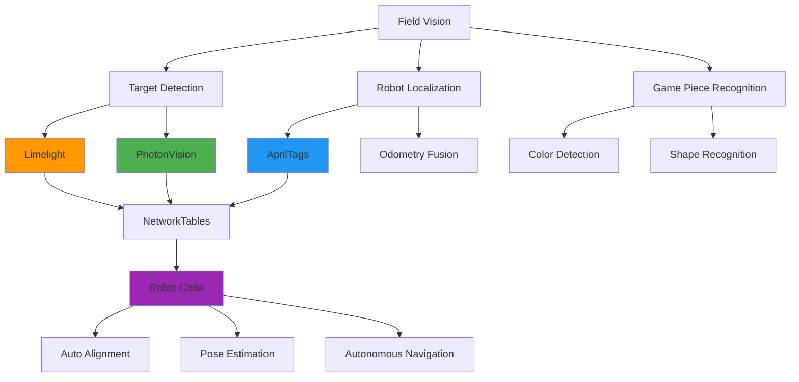
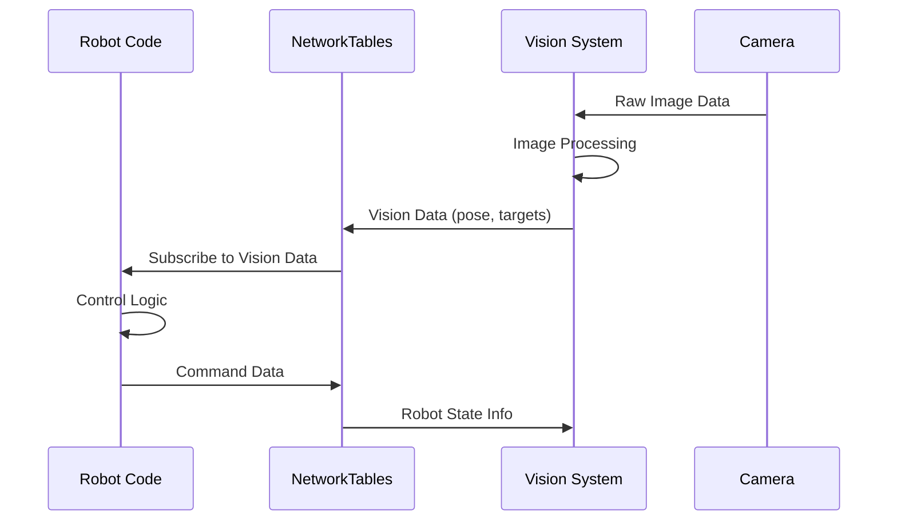
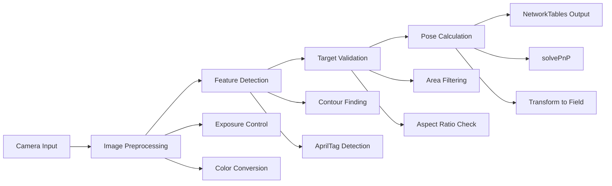

# Vision Systems

Vision processing is a critical component in modern FRC robots, enabling autonomous targeting, field localization, and game piece detection. Team 1757 uses multiple vision solutions depending on the competition requirements and available hardware.

## Vision System Architecture



## Vision Solutions Overview

### Hardware Platforms

| Solution | Hardware | Pros | Cons | Best Use Case |
|----------|----------|------|------|---------------|
| **Limelight** | Dedicated vision computer | Plug-and-play, optimized | Expensive, less flexible | Targeting, simple detection |
| **PhotonVision** | Raspberry Pi, Orange Pi | Cost-effective, flexible | Requires setup | Multi-camera, complex processing |
| **Custom OpenCV** | Any coprocessor | Maximum control | Development intensive | Specialized applications |

### Communication Architecture



## Key Concepts

### Target Detection
- **Retroreflective tape**: High-contrast targeting for game elements
- **Color filtering**: HSV color space filtering for game pieces
- **Contour analysis**: Shape and area filtering for target validation
- **Multi-target tracking**: Tracking multiple targets simultaneously

### Robot Localization
- **AprilTags**: Fiducial markers providing precise 6DOF pose estimation
- **Pose estimation**: 3D position and orientation calculation
- **Sensor fusion**: Combining vision with odometry for robust localization
- **Field mapping**: Using known target positions for global positioning

### Data Processing Pipeline



## Integration with Robot Code

### NetworkTables Communication
```python
# Vision data subscription in robot code
from networktables import NetworkTables as nt

class VisionSubsystem(commands2.SubsystemBase):
    def __init__(self):
        super().__init__()
        self.limelight = nt.getTable("limelight")
        self.photonvision = nt.getTable("photonvision")
        
    def get_target_data(self):
        # Get targeting data from Limelight
        tv = self.limelight.getNumber("tv", 0)  # Valid target
        tx = self.limelight.getNumber("tx", 0)  # Horizontal offset
        ty = self.limelight.getNumber("ty", 0)  # Vertical offset
        ta = self.limelight.getNumber("ta", 0)  # Target area
        
        return {"valid": tv, "x_offset": tx, "y_offset": ty, "area": ta}
    
    def get_pose_estimate(self):
        # Get robot pose from AprilTag detection
        return self.photonvision.getNumberArray("robotPose", [0,0,0,0,0,0])
```

### Auto-Alignment Commands
```python
class AlignToTarget(commands2.CommandBase):
    def __init__(self, drivetrain, vision):
        super().__init__()
        self.drivetrain = drivetrain
        self.vision = vision
        self.rotation_controller = PIDController(0.05, 0, 0.003)
        
    def execute(self):
        target_data = self.vision.get_target_data()
        if target_data["valid"]:
            rotation_speed = self.rotation_controller.calculate(
                target_data["x_offset"], 0
            )
            self.drivetrain.arcade_drive(0, rotation_speed)
        
    def isFinished(self):
        target_data = self.vision.get_target_data()
        return abs(target_data["x_offset"]) < 2.0  # Within 2 degrees
```

## Performance Considerations

### Latency Optimization
- **Camera settings**: Reduce exposure time, adjust resolution
- **Processing pipeline**: Optimize algorithms, reduce unnecessary calculations
- **Network communication**: Minimize data transmission, use efficient protocols
- **Multi-threading**: Parallel processing for image acquisition and analysis

### Reliability Factors
- **Lighting conditions**: Account for varying field lighting
- **Motion blur**: Handle robot movement during image capture
- **Occlusion handling**: Multiple camera angles, redundant detection
- **Fallback systems**: Graceful degradation when vision is unavailable

## Competition Strategy

### Vision System Selection
- **Game analysis**: Determine vision requirements from game manual
- **Field layout**: Map AprilTag positions and target locations
- **Alliance strategy**: Coordinate with alliance partners on shared targets
- **Backup plans**: Implement vision-independent autonomous modes

## Troubleshooting Guide

### Common Issues
1. **No target detection**: Check lighting, camera focus, thresholds
2. **Jittery targeting**: Tune PID controllers, add filtering
3. **Network latency**: Check NetworkTables connection, reduce data rate
4. **Inconsistent pose**: Verify AprilTag positions, check camera calibration

### Diagnostic Tools
- **Camera stream**: Monitor raw camera feed
- **Processed overlay**: Visualize detection results
- **NetworkTables viewer**: Monitor data transmission
- **Field visualization**: Plot robot pose and targets
