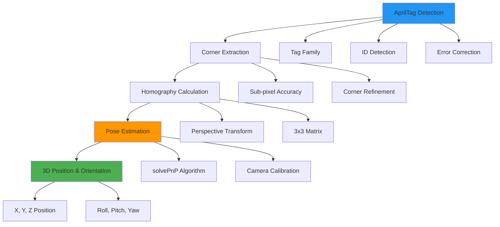
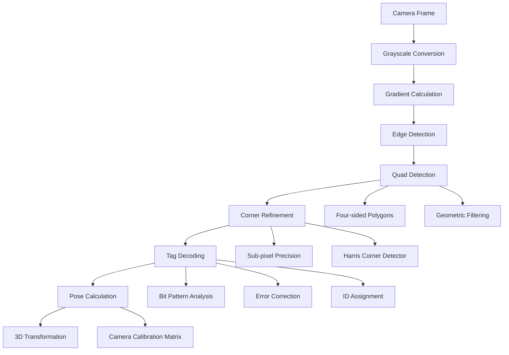
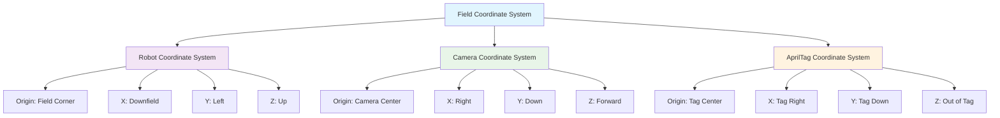

# AprilTags for Robot Localization

AprilTags are fiducial markers that provide precise 6DOF (6 Degrees of Freedom) pose estimation for robot localization in FRC. They are essentially 2D barcodes that can be detected by cameras and used to determine the robot's position and orientation on the field with high accuracy.

## AprilTag Fundamentals



## Tag Families and Selection

### FRC Standard: 36h11
FRC uses the **36h11** tag family, which provides:
- **36**: 6x6 bit data area
- **h11**: Hamming distance of 11 (error correction capability)
- **ID Range**: 1-30 for official field tags, 31+ for custom use
- **Error Tolerance**: Can correct up to 5-bit errors

```python
# Tag family characteristics
class AprilTagFamily:
    FAMILY_36H11 = {
        "name": "tag36h11",
        "total_tags": 587,  # Total possible tags
        "frc_range": range(1, 31),  # Official FRC tags
        "custom_range": range(31, 100),  # Team-specific tags
        "hamming_distance": 11,
        "bit_size": 6,
        "border_size": 1
    }
```

### Official FRC Field Layout (2024 Crescendo Example)

| Tag ID | Location | Alliance | Purpose |
|--------|----------|----------|----------|
| 1-2 | Source Side | Blue | Game piece pickup |
| 3-4 | Speaker | Blue | Scoring target |
| 5 | Amp | Blue | Scoring target |
| 6 | Amp | Red | Scoring target |
| 7-8 | Speaker | Red | Scoring target |
| 9-10 | Source Side | Red | Game piece pickup |
| 11-16 | Stage | Both | Climbing structure |

## Detection Pipeline

### Computer Vision Process



### Detection Parameters

```python
class AprilTagDetector:
    def __init__(self):
        self.detector_params = {
            "families": "tag36h11",
            "nthreads": 4,
            "quad_decimate": 2.0,  # Reduce image resolution for speed
            "quad_sigma": 0.0,     # Gaussian blur (0 = disabled)
            "decode_sharpening": 0.25,  # Bit extraction sharpening
            "refine_edges": True,  # Sub-pixel corner refinement
            "debug": False         # Enable debug visualizations
        }
    
    def configure_for_performance(self, performance_mode="balanced"):
        """Configure detector for different performance requirements"""
        if performance_mode == "speed":
            self.detector_params.update({
                "quad_decimate": 4.0,
                "refine_edges": False,
                "nthreads": 2
            })
        elif performance_mode == "accuracy":
            self.detector_params.update({
                "quad_decimate": 1.0,
                "quad_sigma": 0.8,
                "refine_edges": True,
                "nthreads": 4
            })
```

## Pose Estimation Mathematics

### Camera Model and Calibration

```python
import numpy as np
from wpimath.geometry import Pose3d, Translation3d, Rotation3d

class CameraPoseEstimator:
    def __init__(self, camera_matrix, distortion_coeffs, tag_size):
        """
        camera_matrix: 3x3 intrinsic camera matrix
        distortion_coeffs: 1x5 distortion coefficients
        tag_size: physical size of AprilTag in meters
        """
        self.camera_matrix = camera_matrix
        self.distortion_coeffs = distortion_coeffs
        self.tag_size = tag_size
        
        # 3D object points for AprilTag corners (tag coordinate system)
        # Origin at tag center, Z-axis pointing out of tag
        half_size = tag_size / 2
        self.object_points = np.array([
            [-half_size, -half_size, 0],  # Bottom-left
            [ half_size, -half_size, 0],  # Bottom-right
            [ half_size,  half_size, 0],  # Top-right
            [-half_size,  half_size, 0]   # Top-left
        ], dtype=np.float32)
    
    def estimate_pose(self, image_points):
        """
        Estimate 6DOF pose from detected tag corners
        image_points: 4x2 array of corner pixel coordinates
        """
        # Use OpenCV's solvePnP for pose estimation
        success, rvec, tvec = cv2.solvePnP(
            self.object_points,
            image_points,
            self.camera_matrix,
            self.distortion_coeffs
        )
        
        if success:
            # Convert to WPILib geometry
            translation = Translation3d(tvec[0][0], tvec[1][0], tvec[2][0])
            
            # Convert rotation vector to rotation matrix
            rotation_matrix, _ = cv2.Rodrigues(rvec)
            
            # Convert to WPILib Rotation3d
            rotation = self.rotation_matrix_to_rotation3d(rotation_matrix)
            
            return Pose3d(translation, rotation)
        
        return None
    
    def rotation_matrix_to_rotation3d(self, rotation_matrix):
        """Convert OpenCV rotation matrix to WPILib Rotation3d"""
        # Extract Euler angles from rotation matrix
        import math
        
        sy = math.sqrt(rotation_matrix[0,0]**2 + rotation_matrix[1,0]**2)
        
        if sy < 1e-6:  # Gimbal lock case
            x = math.atan2(-rotation_matrix[1,2], rotation_matrix[1,1])
            y = math.atan2(-rotation_matrix[2,0], sy)
            z = 0
        else:
            x = math.atan2(rotation_matrix[2,1], rotation_matrix[2,2])
            y = math.atan2(-rotation_matrix[2,0], sy)
            z = math.atan2(rotation_matrix[1,0], rotation_matrix[0,0])
        
        return Rotation3d(x, y, z)
```

### Pose Ambiguity Resolution

```python
class PoseAmbiguityResolver:
    def __init__(self):
        self.pose_history = []
        self.max_history = 10
    
    def resolve_ambiguity(self, pose_estimates):
        """
        AprilTag detection can produce multiple valid pose estimates.
        Use various strategies to select the most likely pose.
        """
        if len(pose_estimates) == 1:
            return pose_estimates[0]
        
        # Strategy 1: Choose pose with smaller reprojection error
        best_pose = min(pose_estimates, key=lambda p: p.reprojection_error)
        
        # Strategy 2: Temporal consistency with pose history
        if self.pose_history:
            consistent_pose = self.find_most_consistent_pose(
                pose_estimates, self.pose_history[-1]
            )
            if consistent_pose:
                best_pose = consistent_pose
        
        # Strategy 3: Physical constraints (robot can't teleport)
        best_pose = self.apply_physical_constraints(best_pose)
        
        # Update history
        self.pose_history.append(best_pose)
        if len(self.pose_history) > self.max_history:
            self.pose_history.pop(0)
        
        return best_pose
    
    def find_most_consistent_pose(self, candidates, previous_pose):
        """Find pose with minimum distance from previous pose"""
        min_distance = float('inf')
        best_candidate = None
        
        for candidate in candidates:
            distance = self.calculate_pose_distance(candidate.pose, previous_pose)
            if distance < min_distance:
                min_distance = distance
                best_candidate = candidate
        
        # Only accept if movement is reasonable (< 2 meters in 20ms)
        if min_distance < 2.0:  # meters
            return best_candidate
        
        return None
    
    def calculate_pose_distance(self, pose1, pose2):
        """Calculate 3D distance between two poses"""
        translation_distance = pose1.translation().distance(pose2.translation())
        rotation_distance = abs(
            pose1.rotation().getAngle() - pose2.rotation().getAngle()
        )
        
        # Weighted combination of translation and rotation differences
        return translation_distance + rotation_distance * 0.5
```

## Multi-Tag Localization

### Bundle Adjustment

```python
class MultiTagLocalizer:
    def __init__(self, field_layout):
        self.field_layout = field_layout  # Known positions of all field tags
        self.tag_observations = []
    
    def add_tag_observation(self, tag_id, camera_to_tag_pose, timestamp):
        """Add a tag observation for bundle adjustment"""
        if tag_id in self.field_layout:
            self.tag_observations.append({
                'tag_id': tag_id,
                'camera_to_tag': camera_to_tag_pose,
                'field_to_tag': self.field_layout[tag_id],
                'timestamp': timestamp,
                'weight': self.calculate_observation_weight(camera_to_tag_pose)
            })
    
    def estimate_robot_pose(self, camera_to_robot_transform):
        """Estimate robot pose using all recent tag observations"""
        if len(self.tag_observations) < 1:
            return None
        
        # Filter recent observations (within last 100ms)
        recent_obs = [obs for obs in self.tag_observations 
                     if abs(obs['timestamp'] - time.time()) < 0.1]
        
        if len(recent_obs) == 1:
            # Single tag localization
            return self.single_tag_localization(recent_obs[0], camera_to_robot_transform)
        else:
            # Multi-tag bundle adjustment
            return self.bundle_adjustment(recent_obs, camera_to_robot_transform)
    
    def bundle_adjustment(self, observations, camera_to_robot_transform):
        """Use multiple tag observations for robust pose estimation"""
        robot_poses = []
        weights = []
        
        for obs in observations:
            # Calculate robot pose from this tag observation
            field_to_tag = obs['field_to_tag']
            camera_to_tag = obs['camera_to_tag']
            
            # Transform chain: field -> tag -> camera -> robot
            field_to_camera = field_to_tag.transformBy(camera_to_tag.inverse())
            field_to_robot = field_to_camera.transformBy(camera_to_robot_transform)
            
            robot_poses.append(field_to_robot)
            weights.append(obs['weight'])
        
        # Weighted average of all pose estimates
        return self.weighted_pose_average(robot_poses, weights)
    
    def calculate_observation_weight(self, camera_to_tag_pose):
        """Calculate reliability weight based on tag distance and angle"""
        distance = camera_to_tag_pose.translation().norm()
        
        # Weight decreases with distance (farther = less accurate)
        distance_weight = 1.0 / (1.0 + distance**2)
        
        # Weight decreases with extreme viewing angles
        tag_normal = np.array([0, 0, 1])  # Tag faces +Z direction
        camera_direction = camera_to_tag_pose.translation().tolist()
        camera_direction = np.array(camera_direction) / np.linalg.norm(camera_direction)
        
        angle_weight = abs(np.dot(tag_normal, -camera_direction))
        
        return distance_weight * angle_weight
```

## Field Coordinate System

### FRC Field Layout Integration

```python
import json
from wpimath.geometry import Pose3d, Translation3d, Rotation3d

class FieldLayout:
    def __init__(self, layout_file=None):
        """Load official FRC field layout from JSON file"""
        self.tags = {}
        
        if layout_file:
            self.load_from_json(layout_file)
        else:
            self.load_default_layout()  # 2024 Crescendo as example
    
    def load_from_json(self, filename):
        """Load field layout from WPILib JSON format"""
        with open(filename, 'r') as f:
            data = json.load(f)
        
        field_length = data['field']['length']
        field_width = data['field']['width']
        
        for tag_data in data['tags']:
            tag_id = tag_data['ID']
            pose_data = tag_data['pose']
            
            translation = Translation3d(
                pose_data['translation']['x'],
                pose_data['translation']['y'],
                pose_data['translation']['z']
            )
            
            rotation = Rotation3d(
                pose_data['rotation']['quaternion']['X'],
                pose_data['rotation']['quaternion']['Y'],
                pose_data['rotation']['quaternion']['Z'],
                pose_data['rotation']['quaternion']['W']
            )
            
            self.tags[tag_id] = Pose3d(translation, rotation)
    
    def get_tag_pose(self, tag_id):
        """Get field-relative pose of specified tag"""
        return self.tags.get(tag_id)
    
    def get_alliance_tags(self, alliance_color):
        """Get tags relevant to specified alliance"""
        if alliance_color.lower() == 'blue':
            return {tag_id: pose for tag_id, pose in self.tags.items() 
                   if tag_id in [1, 2, 3, 4, 5, 14, 15, 16]}
        else:  # Red alliance
            return {tag_id: pose for tag_id, pose in self.tags.items() 
                   if tag_id in [6, 7, 8, 9, 10, 11, 12, 13]}
```

### Coordinate System Transformations



## Performance Optimization

### Detection Speed vs Accuracy Trade-offs

```python
class AprilTagOptimizer:
    def __init__(self):
        self.performance_profiles = {
            "competition": {
                "quad_decimate": 2.0,
                "quad_sigma": 0.0,
                "refine_edges": True,
                "nthreads": 4,
                "max_hamming": 2  # Allow some errors for reliability
            },
            
            "practice": {
                "quad_decimate": 1.5,
                "quad_sigma": 0.8,
                "refine_edges": True,
                "nthreads": 4,
                "max_hamming": 0  # Perfect detection only
            },
            
            "debugging": {
                "quad_decimate": 1.0,
                "quad_sigma": 0.0,
                "refine_edges": True,
                "nthreads": 1,
                "debug": True
            }
        }
    
    def optimize_for_distance(self, estimated_distance):
        """Adjust detection parameters based on expected tag distance"""
        if estimated_distance > 5.0:  # Far tags
            return {
                "quad_decimate": 1.0,  # Higher resolution needed
                "refine_edges": True,
                "quad_sigma": 0.8      # Some blur to reduce noise
            }
        elif estimated_distance > 2.0:  # Medium distance
            return {
                "quad_decimate": 2.0,
                "refine_edges": True,
                "quad_sigma": 0.0
            }
        else:  # Close tags
            return {
                "quad_decimate": 3.0,  # Can sacrifice resolution for speed
                "refine_edges": False,
                "quad_sigma": 0.0
            }
```

## Troubleshooting and Validation

### Common Detection Issues

1. **Poor Lighting Conditions**
   ```python
   def validate_lighting(self, image):
       """Check if lighting is adequate for tag detection"""
       mean_brightness = np.mean(image)
       brightness_std = np.std(image)
       
       if mean_brightness < 50:
           return "Too dark - increase lighting"
       elif mean_brightness > 200:
           return "Too bright - reduce exposure or add polarizing filter"
       elif brightness_std < 30:
           return "Low contrast - check lighting uniformity"
       else:
           return "Lighting OK"
   ```

2. **Motion Blur**
   ```python
   def detect_motion_blur(self, image):
       """Detect motion blur that could affect tag detection"""
       laplacian_var = cv2.Laplacian(image, cv2.CV_64F).var()
       
       if laplacian_var < 100:
           return "Possible motion blur detected"
       else:
           return "Image sharpness OK"
   ```

3. **Tag Size and Distance Validation**
   ```python
   def validate_detection(self, tag_detection, expected_tag_size):
       """Validate tag detection against expected parameters"""
       # Check tag size consistency
       detected_corners = tag_detection.corners
       detected_size = self.calculate_tag_size_pixels(detected_corners)
       
       # Estimate distance from tag size
       estimated_distance = (self.camera_focal_length * expected_tag_size) / detected_size
       
       if estimated_distance > 10.0:
           return "Warning: Tag very far - low accuracy expected"
       elif estimated_distance < 0.3:
           return "Warning: Tag very close - may be outside camera FOV soon"
       else:
           return f"Distance estimate: {estimated_distance:.2f}m"
   ```

### Calibration Verification

```python
class CalibrationValidator:
    def __init__(self, known_tag_positions):
        self.known_positions = known_tag_positions
    
    def validate_camera_calibration(self, detections):
        """Verify camera calibration accuracy using known tag positions"""
        position_errors = []
        
        for detection in detections:
            tag_id = detection.tag_id
            if tag_id in self.known_positions:
                # Calculate position from detection
                estimated_pos = self.calculate_tag_position(detection)
                known_pos = self.known_positions[tag_id]
                
                error = estimated_pos.distance(known_pos)
                position_errors.append(error)
        
        if position_errors:
            mean_error = np.mean(position_errors)
            max_error = np.max(position_errors)
            
            print(f"Calibration validation:")
            print(f"  Mean position error: {mean_error:.3f}m")
            print(f"  Max position error: {max_error:.3f}m")
            
            if mean_error > 0.1:  # 10cm average error
                print("  WARNING: High position errors - recalibrate camera")
            else:
                print("  Calibration appears accurate")
```

## Competition Implementation

### Robust Localization System

```python
class CompetitionAprilTagSystem:
    def __init__(self, field_layout, camera_configs):
        self.field_layout = field_layout
        self.cameras = {}
        self.pose_estimator = None
        self.last_valid_poses = {}
        
        # Initialize cameras
        for name, config in camera_configs.items():
            self.cameras[name] = AprilTagCamera(name, config)
    
    def get_robot_pose(self):
        """Get most reliable robot pose estimate"""
        all_observations = []
        
        # Collect observations from all cameras
        for camera in self.cameras.values():
            detections = camera.get_latest_detections()
            for detection in detections:
                if self.validate_detection(detection):
                    all_observations.append(detection)
        
        if not all_observations:
            return None
        
        # Use multi-tag bundle adjustment for best accuracy
        if len(all_observations) >= 2:
            return self.multi_tag_localization(all_observations)
        else:
            return self.single_tag_localization(all_observations[0])
    
    def validate_detection(self, detection):
        """Validate detection quality and consistency"""
        # Check detection quality metrics
        if detection.decision_margin < 50:  # Low confidence
            return False
        
        if detection.hamming_distance > 2:  # Too many bit errors
            return False
        
        # Check for reasonable pose estimate
        pose = detection.pose_estimate
        if pose.translation().norm() > 15:  # Unreasonably far
            return False
        
        # Check temporal consistency
        tag_id = detection.tag_id
        if tag_id in self.last_valid_poses:
            last_pose = self.last_valid_poses[tag_id]
            current_pose = pose
            
            movement = last_pose.translation().distance(current_pose.translation())
            time_diff = detection.timestamp - last_pose.timestamp
            
            # Robot can't move faster than 5 m/s
            if movement / time_diff > 5.0:
                return False
        
        # Update pose history
        self.last_valid_poses[tag_id] = {
            'pose': pose,
            'timestamp': detection.timestamp
        }
        
        return True
```

AprilTags provide the foundation for accurate robot localization in FRC, enabling autonomous navigation and precise game piece manipulation. Proper implementation requires careful attention to camera calibration, detection parameters, and pose estimation algorithms.
