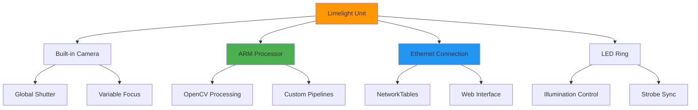
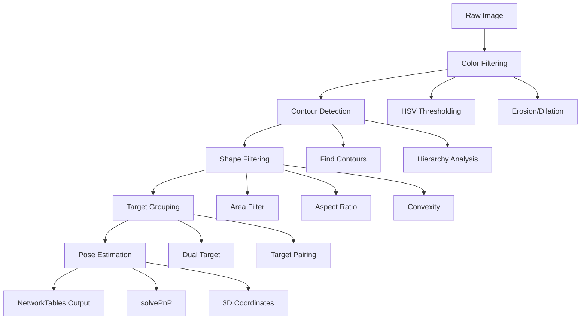

# Limelight Vision System

The Limelight is a plug-and-play smart camera designed specifically for FRC robots. It provides high-performance vision processing with minimal setup, making it ideal for targeting applications and game piece detection.

## Hardware Overview



## Initial Setup

### Network Configuration
1. **Connect to Limelight**: Use Ethernet cable or WiFi
2. **Access Web Interface**: Navigate to `http://limelight.local:5801`
3. **Network Settings**: Configure for robot network (10.TE.AM.11)
4. **Firmware Update**: Ensure latest firmware is installed

### Camera Calibration
```python
# Camera intrinsics for distance calculation
# These values are specific to each Limelight unit
CAMERA_HEIGHT = 0.5  # meters from ground
TARGET_HEIGHT = 2.5  # meters - typical FRC target height
CAMERA_ANGLE = 15    # degrees - mounting angle
```

## Vision Pipeline Configuration

### Pipeline Setup Process



### HSV Color Filtering
- **Hue**: Target color range (retroreflective green: 60-100)
- **Saturation**: Color intensity (150-255)
- **Value**: Brightness threshold (200-255)
- **Exposure**: Manual control (0-128, typically 1-10 for retroreflective)

### Contour Filtering Parameters
| Parameter | Typical Range | Purpose |
|-----------|---------------|----------|
| **Area** | 0.01-100% | Remove small noise |
| **Width/Height** | 0.1-10.0 | Target aspect ratio |
| **Solidity** | 75-100% | Shape completeness |
| **Max Vertices** | 4-1000 | Polygon complexity |

## Robot Integration

### NetworkTables Data Structure

```python
import networktables as nt
from wpilib import SmartDashboard

class LimelightVision:
    def __init__(self):
        self.table = nt.NetworkTables.getTable("limelight")
        
    def get_values(self):
        """
        Get all Limelight values in a single call for efficiency
        """
        return {
            "tv": self.table.getNumber("tv", 0),      # Valid target (0 or 1)
            "tx": self.table.getNumber("tx", 0),      # Horizontal offset (-27 to 27 degrees)
            "ty": self.table.getNumber("ty", 0),      # Vertical offset (-20.5 to 20.5 degrees)
            "ta": self.table.getNumber("ta", 0),      # Target area (0 to 100% of image)
            "ts": self.table.getNumber("ts", 0),      # Target skew/rotation (-90 to 0 degrees)
            "tl": self.table.getNumber("tl", 0),      # Latency (ms)
            "tshort": self.table.getNumber("tshort", 0), # Shorter side length
            "tlong": self.table.getNumber("tlong", 0),   # Longer side length
            "thoriz": self.table.getNumber("thoriz", 0), # Horizontal side length
            "tvert": self.table.getNumber("tvert", 0),   # Vertical side length
        }
    
    def set_pipeline(self, pipeline_number):
        """Switch between vision pipelines (0-9)"""
        self.table.putNumber("pipeline", pipeline_number)
    
    def set_led_mode(self, mode):
        """
        Control LED state:
        0: Use pipeline default
        1: Force off
        2: Force blink
        3: Force on
        """
        self.table.putNumber("ledMode", mode)
    
    def set_camera_mode(self, mode):
        """
        Control camera mode:
        0: Vision processing
        1: Driver camera (exposure and color balance optimized)
        """
        self.table.putNumber("camMode", mode)
```

### Distance Calculation

```python
import math

class DistanceCalculator:
    def __init__(self, camera_height, target_height, camera_angle):
        self.camera_height = camera_height  # meters
        self.target_height = target_height  # meters
        self.camera_angle = math.radians(camera_angle)  # convert to radians
    
    def calculate_distance(self, ty):
        """
        Calculate distance to target using trigonometry
        ty: vertical offset from Limelight in degrees
        """
        ty_radians = math.radians(ty)
        angle_to_target = self.camera_angle + ty_radians
        
        distance = (self.target_height - self.camera_height) / math.tan(angle_to_target)
        return abs(distance)
    
    def calculate_angle_offset(self, tx):
        """
        Convert horizontal pixel offset to real-world angle
        tx: horizontal offset from Limelight in degrees
        """
        return tx  # Limelight already provides this in degrees
```

### Advanced Targeting Commands

```python
class AdvancedLimelightAlign(commands2.CommandBase):
    def __init__(self, drivetrain, limelight, target_distance=2.0):
        super().__init__()
        self.drivetrain = drivetrain
        self.limelight = limelight
        self.target_distance = target_distance
        
        # PID controllers for alignment
        self.rotation_pid = PIDController(0.05, 0.01, 0.003)
        self.distance_pid = PIDController(0.8, 0.1, 0.05)
        
        # Tolerance values
        self.rotation_tolerance = 2.0  # degrees
        self.distance_tolerance = 0.1  # meters
        
        self.addRequirements(drivetrain)
    
    def initialize(self):
        self.limelight.set_pipeline(0)  # Use targeting pipeline
        self.limelight.set_led_mode(3)  # Turn on LEDs
        
    def execute(self):
        values = self.limelight.get_values()
        
        if values["tv"] == 1:  # Valid target detected
            # Calculate desired outputs
            rotation_speed = self.rotation_pid.calculate(values["tx"], 0)
            
            # Distance-based forward speed
            current_distance = self.limelight.calculate_distance(values["ty"])
            forward_speed = self.distance_pid.calculate(
                current_distance, self.target_distance
            )
            
            # Apply speed limits and deadbands
            rotation_speed = max(-0.5, min(0.5, rotation_speed))
            forward_speed = max(-0.3, min(0.3, forward_speed)
            
            self.drivetrain.arcade_drive(forward_speed, rotation_speed)
            
            # Log data for debugging
            SmartDashboard.putNumber("LL Distance", current_distance)
            SmartDashboard.putNumber("LL TX", values["tx"])
            SmartDashboard.putNumber("LL TY", values["ty"])
        else:
            # No target - stop robot
            self.drivetrain.arcade_drive(0, 0)
    
    def isFinished(self):
        values = self.limelight.get_values()
        if values["tv"] != 1:
            return False
        
        # Check if aligned within tolerances
        angle_aligned = abs(values["tx"]) < self.rotation_tolerance
        distance_aligned = abs(
            self.limelight.calculate_distance(values["ty"]) - self.target_distance
        ) < self.distance_tolerance
        
        return angle_aligned and distance_aligned
    
    def end(self, interrupted):
        self.limelight.set_led_mode(1)  # Turn off LEDs
        self.drivetrain.arcade_drive(0, 0)
```

## Multi-Pipeline Strategy

### Pipeline Organization
- **Pipeline 0**: Retroreflective targeting (competition)
- **Pipeline 1**: AprilTag detection (pose estimation)
- **Pipeline 2**: Game piece detection (color-based)
- **Pipeline 3**: Driver camera mode

```python
class VisionPipelineManager:
    TARGETING = 0
    APRILTAGS = 1
    GAME_PIECES = 2
    DRIVER_CAM = 3
    
    def __init__(self, limelight):
        self.limelight = limelight
        self.current_pipeline = self.TARGETING
    
    def switch_to_targeting(self):
        if self.current_pipeline != self.TARGETING:
            self.limelight.set_pipeline(self.TARGETING)
            self.limelight.set_led_mode(3)  # LEDs on
            self.current_pipeline = self.TARGETING
    
    def switch_to_driver_cam(self):
        if self.current_pipeline != self.DRIVER_CAM:
            self.limelight.set_pipeline(self.DRIVER_CAM)
            self.limelight.set_camera_mode(1)  # Driver mode
            self.limelight.set_led_mode(1)  # LEDs off
            self.current_pipeline = self.DRIVER_CAM
```

## Performance Optimization

### Reducing Latency
- **Lower resolution**: 320x240 for targeting, 160x120 for tracking
- **Reduce exposure**: Minimum needed for target detection
- **Optimize thresholds**: Precise HSV ranges reduce processing
- **Single pipeline**: Avoid frequent pipeline switching

### Power Management
- **LED control**: Turn off when not needed
- **Pipeline efficiency**: Simpler pipelines consume less power
- **Camera mode**: Switch to driver mode during teleop

## Troubleshooting

### Common Issues
1. **No target detection**:
   - Check LED functionality
   - Verify HSV thresholds
   - Confirm retroreflective tape condition
   - Test exposure settings

2. **Inconsistent targeting**:
   - Tune contour filtering parameters
   - Check for reflections or false positives
   - Verify stable robot positioning
   - Consider dual-target algorithms

3. **High latency**:
   - Reduce image resolution
   - Simplify pipeline processing
   - Check network congestion
   - Optimize robot code polling rate

### Diagnostic Tools
```python
class LimelightDiagnostics:
    def __init__(self, limelight):
        self.limelight = limelight
    
    def log_vision_data(self):
        values = self.limelight.get_values()
        SmartDashboard.putBoolean("LL Has Target", values["tv"] == 1)
        SmartDashboard.putNumber("LL Latency", values["tl"])
        SmartDashboard.putNumber("LL Area", values["ta"])
        
        # Performance metrics
        if values["tl"] > 50:
            print("WARNING: High Limelight latency detected")
        
        if values["tv"] == 1 and values["ta"] < 0.5:
            print("WARNING: Target very small, may be unreliable")
```

## Competition Checklist

### Pre-Match
- [ ] Verify Limelight IP address (10.TE.AM.11)
- [ ] Test all vision pipelines
- [ ] Confirm LED functionality
- [ ] Check camera focus and cleanliness
- [ ] Validate NetworkTables connection
- [ ] Test targeting commands in autonomous

### During Competition
- [ ] Monitor vision latency on dashboard
- [ ] Watch for false positive detections
- [ ] Verify LED synchronization with camera
- [ ] Check for retroreflective tape damage
- [ ] Validate distance calculations

For detailed setup instructions and advanced features, refer to the official [Limelight documentation](https://docs.limelightvision.io/).
