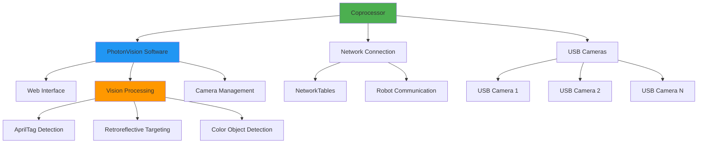
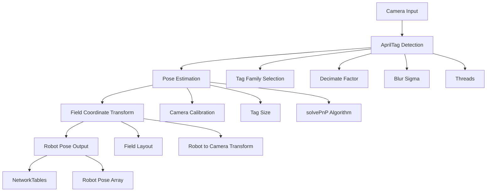

# PhotonVision

PhotonVision is an open-source vision processing solution designed for FRC robots. It runs on coprocessors like Raspberry Pi or Orange Pi and provides flexible, cost-effective vision processing with advanced features like AprilTag detection and multi-camera support.

## System Architecture



## Hardware Setup

### Recommended Hardware

| Component | Specification | Purpose |
|-----------|---------------|----------|
| **Coprocessor** | Raspberry Pi 4B (4GB+) | Main processing unit |
| **Storage** | 32GB+ MicroSD (Class 10) | OS and data storage |
| **Cameras** | USB 3.0 with global shutter | Image capture |
| **Network** | Gigabit Ethernet preferred | Robot communication |
| **Power** | 5V 3A supply | Stable power delivery |

### Installation Process

```bash
# Download and flash PhotonVision image
# Available at: https://github.com/PhotonVision/photon-pi-gen/releases

# Or install on existing Raspberry Pi OS
wget -qO - https://github.com/PhotonVision/photon-pi-gen/releases/download/v2023.4.2/photon-pi-gen-v2023.4.2.img.xz
sudo dd if=photon-pi-gen-v2023.4.2.img of=/dev/sdX bs=4M status=progress
```

### Network Configuration

```bash
# Configure static IP on robot network
# Edit /etc/dhcpcd.conf
interface eth0
static ip_address=10.TE.AM.12/24
static routers=10.TE.AM.1
static domain_name_servers=8.8.8.8

# Access web interface at http://10.TE.AM.12:5800
```

## Vision Pipeline Configuration

### AprilTag Pipeline Setup



### Camera Calibration

```python
# Camera calibration is essential for accurate pose estimation
# Use the calibration tool in PhotonVision web interface

import numpy as np

class CameraCalibration:
    def __init__(self):
        # Example calibration parameters (must be measured for each camera)
        self.camera_matrix = np.array([
            [700.0, 0.0, 320.0],
            [0.0, 700.0, 240.0],
            [0.0, 0.0, 1.0]
        ])
        
        self.distortion_coeffs = np.array([0.1, -0.2, 0.0, 0.0, 0.0])
        
    def get_fov(self):
        """Calculate field of view from camera matrix"""
        fx, fy = self.camera_matrix[0, 0], self.camera_matrix[1, 1]
        width, height = 640, 480
        
        fov_x = 2 * np.arctan(width / (2 * fx))
        fov_y = 2 * np.arctan(height / (2 * fy))
        
        return np.degrees(fov_x), np.degrees(fov_y)
```

### Pipeline Configuration Parameters

#### AprilTag Settings
- **Tag Family**: 36h11 (FRC standard)
- **Decimate**: 2.0 (balance speed vs accuracy)
- **Blur**: 0.0 (start with no blur)
- **Threads**: 4 (match processor cores)
- **Debug**: Enabled for tuning

#### Retroreflective Settings
- **HSV Range**: Tune for target color
- **Contour Filtering**: Area, aspect ratio, solidity
- **Multi-target**: Group nearby targets
- **3D Mode**: Enable for distance calculation

## Robot Integration

### PhotonVision Python Library

```python
# Install: pip install photonlibpy
from photonlibpy import PhotonCamera, PhotonUtils
from photonlibpy.targeting import PhotonPipelineResult
from wpimath.geometry import Pose3d, Transform3d, Translation3d, Rotation3d
from wpimath.units import meters, degrees
import math

class PhotonVisionSubsystem(commands2.SubsystemBase):
    def __init__(self):
        super().__init__()
        
        # Initialize cameras
        self.apriltag_camera = PhotonCamera("apriltags")  # Camera name in PhotonVision
        self.targeting_camera = PhotonCamera("targeting")
        
        # Robot to camera transform (adjust for your robot)
        self.robot_to_camera = Transform3d(
            Translation3d(0.5, 0.0, 0.5),  # 0.5m forward, 0.5m up
            Rotation3d(0, math.radians(-20), 0)  # 20 degrees down
        )
        
        # Field layout for AprilTag positioning
        self.field_layout = None  # Load from FRC field layout JSON
        
    def get_apriltag_pose(self):
        """Get robot pose from AprilTag detection"""
        result = self.apriltag_camera.getLatestResult()
        
        if result.hasTargets():
            # Get the best target (closest/most reliable)
            target = result.getBestTarget()
            
            if self.field_layout and target.getFiducialId() > 0:
                # Calculate robot pose using field layout
                tag_pose = self.field_layout.getTagPose(target.getFiducialId())
                if tag_pose:
                    camera_to_target = target.getBestCameraToTarget()
                    camera_pose = tag_pose.transformBy(camera_to_target.inverse())
                    robot_pose = camera_pose.transformBy(self.robot_to_camera.inverse())
                    return robot_pose
        
        return None
    
    def get_targeting_data(self):
        """Get targeting information for game pieces or goals"""
        result = self.targeting_camera.getLatestResult()
        
        if result.hasTargets():
            target = result.getBestTarget()
            
            return {
                "valid": True,
                "yaw": target.getYaw(),
                "pitch": target.getPitch(),
                "area": target.getArea(),
                "skew": target.getSkew(),
                "latency": result.getLatencyMillis(),
                "timestamp": result.getTimestampSeconds()
            }
        
        return {"valid": False}
    
    def calculate_distance_to_target(self, target_height=2.5, camera_height=0.5, camera_angle=20):
        """Calculate distance using target pitch angle"""
        targeting_data = self.get_targeting_data()
        
        if targeting_data["valid"]:
            return PhotonUtils.calculateDistanceToTargetMeters(
                camera_height,
                target_height,
                math.radians(camera_angle),
                math.radians(targeting_data["pitch"])
            )
        
        return None
```

### Advanced Pose Estimation

```python
from wpimath.estimator import SwerveDrivePoseEstimator
from wpimath.geometry import Pose2d

class VisionPoseEstimator:
    def __init__(self, drivetrain, photon_vision):
        self.drivetrain = drivetrain
        self.photon_vision = photon_vision
        
        # Create pose estimator (example for swerve drive)
        self.pose_estimator = SwerveDrivePoseEstimator(
            drivetrain.kinematics,
            drivetrain.get_rotation(),
            drivetrain.get_module_positions(),
            Pose2d(),  # Initial pose
        )
        
        # Vision measurement standard deviations
        self.vision_measurement_std_devs = [0.5, 0.5, 0.5]  # x, y, rotation in meters/radians
    
    def update(self):
        """Update pose estimator with odometry and vision measurements"""
        # Update with odometry
        self.pose_estimator.update(
            self.drivetrain.get_rotation(),
            self.drivetrain.get_module_positions()
        )
        
        # Add vision measurements
        vision_pose = self.photon_vision.get_apriltag_pose()
        if vision_pose:
            # Convert Pose3d to Pose2d for 2D pose estimator
            pose_2d = vision_pose.toPose2d()
            
            # Add vision measurement with timestamp
            self.pose_estimator.addVisionMeasurement(
                pose_2d,
                self.photon_vision.get_last_timestamp(),
                self.vision_measurement_std_devs
            )
    
    def get_estimated_pose(self):
        """Get current best estimate of robot pose"""
        return self.pose_estimator.getEstimatedPosition()
```

### Multi-Camera Management

```python
class MultiCameraVision:
    def __init__(self):
        self.cameras = {
            "front": PhotonCamera("front_camera"),
            "back": PhotonCamera("back_camera"),
            "left": PhotonCamera("left_camera"),
            "right": PhotonCamera("right_camera")
        }
        
        # Camera transforms relative to robot center
        self.camera_transforms = {
            "front": Transform3d(Translation3d(0.3, 0.0, 0.5), Rotation3d()),
            "back": Transform3d(Translation3d(-0.3, 0.0, 0.5), Rotation3d(0, 0, math.pi)),
            "left": Transform3d(Translation3d(0.0, 0.3, 0.5), Rotation3d(0, 0, math.pi/2)),
            "right": Transform3d(Translation3d(0.0, -0.3, 0.5), Rotation3d(0, 0, -math.pi/2))
        }
    
    def get_best_apriltag_measurement(self):
        """Get the most reliable AprilTag measurement from all cameras"""
        best_measurement = None
        best_confidence = 0
        
        for camera_name, camera in self.cameras.items():
            result = camera.getLatestResult()
            
            if result.hasTargets():
                target = result.getBestTarget()
                
                # Calculate confidence based on area and ambiguity
                confidence = target.getArea() * (1 - target.getPoseAmbiguity())
                
                if confidence > best_confidence:
                    best_confidence = confidence
                    best_measurement = {
                        "camera": camera_name,
                        "target": target,
                        "transform": self.camera_transforms[camera_name],
                        "timestamp": result.getTimestampSeconds()
                    }
        
        return best_measurement
```

## Performance Optimization

### Processing Pipeline Tuning

```python
class PerformanceMonitor:
    def __init__(self, camera):
        self.camera = camera
        self.latency_history = []
        self.fps_history = []
    
    def monitor_performance(self):
        """Monitor and log performance metrics"""
        result = self.camera.getLatestResult()
        
        if result:
            latency = result.getLatencyMillis()
            self.latency_history.append(latency)
            
            # Calculate FPS from timestamp differences
            current_time = result.getTimestampSeconds()
            if hasattr(self, 'last_timestamp'):
                fps = 1.0 / (current_time - self.last_timestamp)
                self.fps_history.append(fps)
            
            self.last_timestamp = current_time
            
            # Keep only recent history
            if len(self.latency_history) > 100:
                self.latency_history.pop(0)
            if len(self.fps_history) > 100:
                self.fps_history.pop(0)
    
    def get_average_latency(self):
        return sum(self.latency_history) / len(self.latency_history) if self.latency_history else 0
    
    def get_average_fps(self):
        return sum(self.fps_history) / len(self.fps_history) if self.fps_history else 0
```

### Resource Management

- **CPU Usage**: Monitor with `htop`, target <80% usage
- **Memory**: Ensure sufficient RAM, use swap if needed
- **Network Bandwidth**: Optimize data transmission
- **USB Bandwidth**: Distribute cameras across USB buses
- **Storage**: Use high-speed SD cards, monitor wear

## Troubleshooting

### Common Issues

1. **High Latency**:
   ```bash
   # Check system load
   htop
   
   # Monitor network latency
   ping 10.TE.AM.2  # RoboRIO
   
   # Check USB bus utilization
   lsusb -v
   ```

2. **Poor AprilTag Detection**:
   - Verify tag family (36h11 for FRC)
   - Check camera focus and exposure
   - Validate tag size configuration
   - Ensure adequate lighting

3. **NetworkTables Connection Issues**:
   ```python
   # Test NetworkTables connection
   from networktables import NetworkTables
   
   NetworkTables.initialize(server='10.TE.AM.2')
   table = NetworkTables.getTable('photonvision')
   
   # Check connection status
   print(f"Connected: {NetworkTables.isConnected()}")
   ```

### Diagnostic Commands

```bash
# Check PhotonVision service status
sudo systemctl status photonvision

# View logs
sudo journalctl -u photonvision -f

# Check camera connectivity
v4l2-ctl --list-devices

# Monitor system resources
top -p $(pgrep -f photonvision)

# Test camera capture
v4l2-ctl --device=/dev/video0 --stream-mmap --stream-count=10
```

## Competition Configuration

### Pre-Competition Checklist
- [ ] Update PhotonVision to latest stable version
- [ ] Calibrate all cameras with field lighting
- [ ] Test AprilTag detection at various distances
- [ ] Verify network configuration (10.TE.AM.12)
- [ ] Backup configuration files
- [ ] Test failover to pure odometry

### Field Setup
```python
class FieldConfiguration:
    def __init__(self):
        # Load official field layout from WPILib
        from wpilib import DriverStation
        
        self.field_layout = DriverStation.getAlliance()  # Get alliance color
        self.apriltag_positions = self.load_apriltag_layout()
        
    def configure_for_alliance(self, alliance_color):
        """Configure vision processing based on alliance color"""
        if alliance_color == DriverStation.Alliance.kRed:
            # Configure for red alliance specific targets
            self.primary_targets = [3, 4, 5]  # Red alliance tags
        else:
            # Configure for blue alliance specific targets
            self.primary_targets = [6, 7, 8]  # Blue alliance tags
```

For comprehensive documentation and advanced features, visit the [PhotonVision documentation](https://docs.photonvision.org/).
